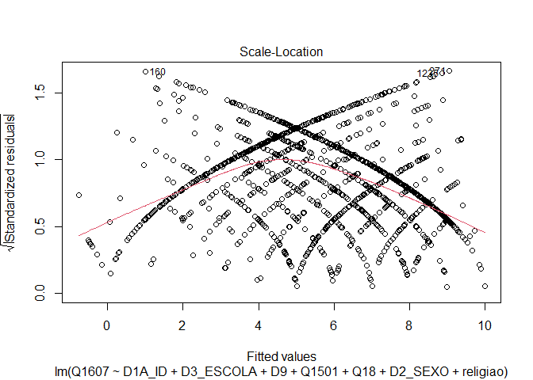

Exercicio 11
================

``` r
library(tidyverse)
library(haven)

link <- "https://github.com/MartinsRodrigo/Analise-de-dados/blob/master/04622.sav?raw=true"

download.file(link, "04622.sav", mode = "wb")

banco <- read_spss("04622.sav")

banco <- banco %>%
  mutate(D10 = as_factor(D10)) %>%
  filter(Q1607 < 11, 
         Q18 < 11,
         D9 < 9999998,
         Q1501 < 11)


Outras <- levels(banco$D10)[-c(3,5,13)]

banco <- banco %>%
  mutate(religiao = case_when(D10 %in% Outras ~ "Outras",
                              D10 == "Católica" ~ "Católica",
                              D10 == "Evangélica" ~ "Evangélica",
                              D10 == "Não tem religião" ~ "Não tem religião"))
```

### Faça uma regressão linear avaliando em que medida as variáveis independentes utilizadas nos exercícios 7 e 8, idade(D1A\_ID), educação (D3\_ESCOLA), renda (D9), nota atribuída ao PT (Q1501), auto-atribuição ideológica (Q18), sexo (D2\_SEXO) e religião (variável criada no passo anterior) explicam a avaliação de Bolsonaro (Q1607)

``` r
options("scipen" = 10)
regressão_multivariada <- lm(Q1607 ~ D1A_ID + D3_ESCOLA + D9 + Q1501 + Q18 + D2_SEXO + religiao, data = banco)
summary(regressão_multivariada)
```

    ## 
    ## Call:
    ## lm(formula = Q1607 ~ D1A_ID + D3_ESCOLA + D9 + Q1501 + Q18 + 
    ##     D2_SEXO + religiao, data = banco)
    ## 
    ## Residuals:
    ##     Min      1Q  Median      3Q     Max 
    ## -9.0608 -2.5654  0.4179  2.3268  8.9954 
    ## 
    ## Coefficients:
    ##                             Estimate  Std. Error t value  Pr(>|t|)    
    ## (Intercept)               6.21603337  0.53652155  11.586   < 2e-16 ***
    ## D1A_ID                    0.01040331  0.00623408   1.669  0.095376 .  
    ## D3_ESCOLA                -0.11159236  0.04486448  -2.487  0.012982 *  
    ## D9                       -0.00003620  0.00002764  -1.309  0.190576    
    ## Q1501                    -0.39463597  0.02367397 -16.670   < 2e-16 ***
    ## Q18                       0.31608133  0.02603275  12.142   < 2e-16 ***
    ## D2_SEXO                  -0.68735722  0.17457327  -3.937 0.0000863 ***
    ## religiaoEvangélica        0.66853691  0.19839649   3.370  0.000772 ***
    ## religiaoNão tem religião -0.07564700  0.34847549  -0.217  0.828177    
    ## religiaoOutras           -0.83255901  0.30807160  -2.702  0.006963 ** 
    ## ---
    ## Signif. codes:  0 '***' 0.001 '**' 0.01 '*' 0.05 '.' 0.1 ' ' 1
    ## 
    ## Residual standard error: 3.296 on 1452 degrees of freedom
    ## Multiple R-squared:  0.3018, Adjusted R-squared:  0.2975 
    ## F-statistic: 69.75 on 9 and 1452 DF,  p-value: < 2.2e-16

### Faça o teste de homoscedasticidade do modelo e corrija as estimações dos coeficientes caso seja necessário.

RESPOSTA: Percebe-se que os casos não estão uniformemente distribuídos
nos gráficos, indicando um problema grave de heterocedasticidade. Os
dois testes realizados também deram p-valores muito baixos, o que indica
não é possível rejeitar a hipótese nula (da presença de
homocedasticidade). Os valores corrigidos do p-valor pouquíssimas
diferenças. O da variável idade continou similar e significnte no limiar
de 90%, o de escolaridade aumentou muito pouco na casa milesimal e
continuou significante no limiar de 95%, renda continuou sem
significância. Já nota ao PT e ideologia continuaram extremamente
significantes. Sexo continou estatisticamente significante, assim como
as categorias evangélicos e outras religiões dentro da variável
religião. A categoria dos que não tem religião também continuou sem
significÂncia significância, o que confirmaria sua diferença com relação
aos católicos.

``` r
library(lmtest)
library(car)
library(sandwich)

plot(regressão_multivariada, 3)
```

<!-- -->

``` r
plot(regressão_multivariada, 1)
```

<!-- -->

``` r
bptest(regressão_multivariada)
```

    ## 
    ##  studentized Breusch-Pagan test
    ## 
    ## data:  regressão_multivariada
    ## BP = 65.763, df = 9, p-value = 0.0000000001025

``` r
ncvTest(regressão_multivariada)
```

    ## Non-constant Variance Score Test 
    ## Variance formula: ~ fitted.values 
    ## Chisquare = 22.48512, Df = 1, p = 0.0000021178

``` r
coeftest(regressão_multivariada,
         vcov = vcovHC(regressão_multivariada))
```

    ## 
    ## t test of coefficients:
    ## 
    ##                              Estimate   Std. Error  t value  Pr(>|t|)    
    ## (Intercept)               6.216033373  0.547150049  11.3607 < 2.2e-16 ***
    ## D1A_ID                    0.010403315  0.006265737   1.6603 0.0970600 .  
    ## D3_ESCOLA                -0.111592364  0.047246617  -2.3619 0.0183123 *  
    ## D9                       -0.000036198  0.000036481  -0.9922 0.3212463    
    ## Q1501                    -0.394635969  0.026380595 -14.9593 < 2.2e-16 ***
    ## Q18                       0.316081330  0.028534369  11.0772 < 2.2e-16 ***
    ## D2_SEXO                  -0.687357219  0.179671825  -3.8256 0.0001360 ***
    ## religiaoEvangélica        0.668536912  0.196758399   3.3978 0.0006978 ***
    ## religiaoNão tem religião -0.075646997  0.374880332  -0.2018 0.8401094    
    ## religiaoOutras           -0.832559012  0.305917010  -2.7215 0.0065759 ** 
    ## ---
    ## Signif. codes:  0 '***' 0.001 '**' 0.01 '*' 0.05 '.' 0.1 ' ' 1

### Avalie a multicolinearidade entre as variáveis

RESPOSTA: Fazendo o teste com a função vif, todas as variáveis tiveram
valores próximos de 1, o que afasta o probelma de multicolinearidade. No
seu turno, o gráfico de linearidade traz uma reta muito próxima da linha
de tracejada de referência, confirmando a relativa ausência de
multicolinearidade do modelo.

``` r
plot(regressão_multivariada, 1)
```

<!-- -->

``` r
vif(regressão_multivariada)
```

    ##               GVIF Df GVIF^(1/(2*Df))
    ## D1A_ID    1.219401  1        1.104265
    ## D3_ESCOLA 1.337368  1        1.156446
    ## D9        1.094849  1        1.046350
    ## Q1501     1.119818  1        1.058215
    ## Q18       1.049195  1        1.024302
    ## D2_SEXO   1.023001  1        1.011435
    ## religiao  1.093846  3        1.015062

### Verifique a presença de outilier ou observações influentes no modelo

RESPOSTA: o gráfico com as linhas vermelhas mostra que nenhum dos casos
é um outlier de fato, mas, ainda assim, com o gráfico do Cook’s
distance, é possível notar que os casos 160, 399 e 1442 são os mais
influentes, destacando-se o 1442.

``` r
plot(regressão_multivariada, 4)
```

<!-- -->

``` r
plot(regressão_multivariada, 5)
```

<!-- -->

### Faça a regressao linear sem a observação mais influente e avalie a alteração do resultado

RESPOSTA: Não houve tanta mudança nem nos coeficientes nem nos
p-valores. A única grande diferença foi que a variável renda ganhou
significância estatística. Mas todos os coeficientes estão relativamente
próximos dos anteriores, assim como a maioria dos p-valores. Por fim, o
erro-padrão dos resíduos diminuiu um pouco como esperado, e o r-quadrado
subiu bem pouco também. Isso indica que, apesar da observação retirada
ser uma observação influente, ela não era um outlier como os gráficos
deixaram claro, ou seja, a sua retirada não trouxe grandes diferenças
paras os resultados gerais do modelo de regressão.

``` r
banco_2 <- banco %>%
  slice(-c(1442))
options("scipen" = 10)
regressão_multivariada_2 <- lm(Q1607 ~ D1A_ID + D3_ESCOLA + D9 + Q1501 + Q18 + D2_SEXO + religiao, data = banco_2)
summary(regressão_multivariada_2)
```

    ## 
    ## Call:
    ## lm(formula = Q1607 ~ D1A_ID + D3_ESCOLA + D9 + Q1501 + Q18 + 
    ##     D2_SEXO + religiao, data = banco_2)
    ## 
    ## Residuals:
    ##     Min      1Q  Median      3Q     Max 
    ## -9.1171 -2.4749  0.3718  2.3110  8.9899 
    ## 
    ## Coefficients:
    ##                             Estimate  Std. Error t value  Pr(>|t|)    
    ## (Intercept)               6.23965722  0.53604055  11.640   < 2e-16 ***
    ## D1A_ID                    0.01132731  0.00624311   1.814  0.069827 .  
    ## D3_ESCOLA                -0.10218339  0.04504484  -2.268  0.023446 *  
    ## D9                       -0.00006396  0.00003071  -2.083  0.037444 *  
    ## Q1501                    -0.39749731  0.02368788 -16.781   < 2e-16 ***
    ## Q18                       0.31566706  0.02600427  12.139   < 2e-16 ***
    ## D2_SEXO                  -0.70799318  0.17466287  -4.053 0.0000531 ***
    ## religiaoEvangélica        0.68070141  0.19826096   3.433  0.000613 ***
    ## religiaoNão tem religião -0.06670578  0.34811077  -0.192  0.848065    
    ## religiaoOutras           -0.81932654  0.30779202  -2.662  0.007855 ** 
    ## ---
    ## Signif. codes:  0 '***' 0.001 '**' 0.01 '*' 0.05 '.' 0.1 ' ' 1
    ## 
    ## Residual standard error: 3.292 on 1451 degrees of freedom
    ## Multiple R-squared:  0.3037, Adjusted R-squared:  0.2994 
    ## F-statistic: 70.32 on 9 and 1451 DF,  p-value: < 2.2e-16
