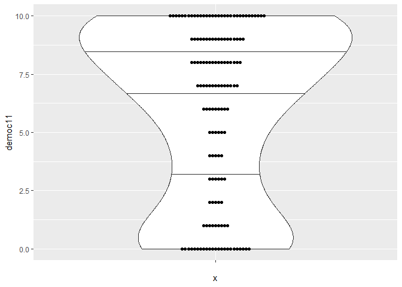
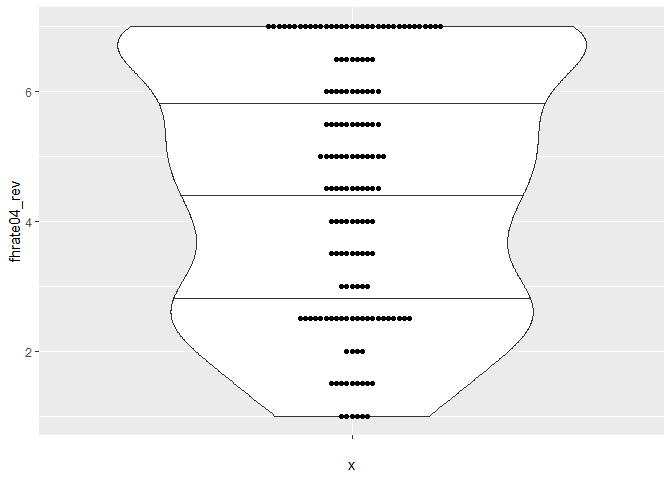
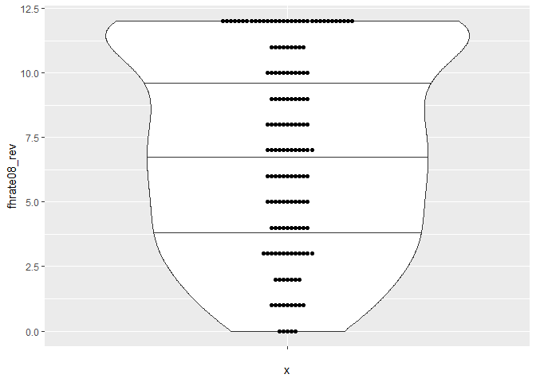
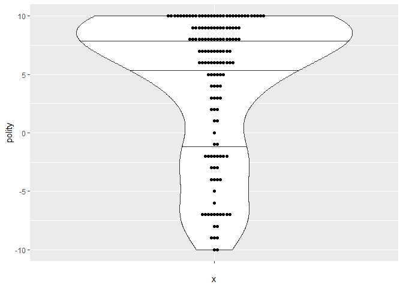
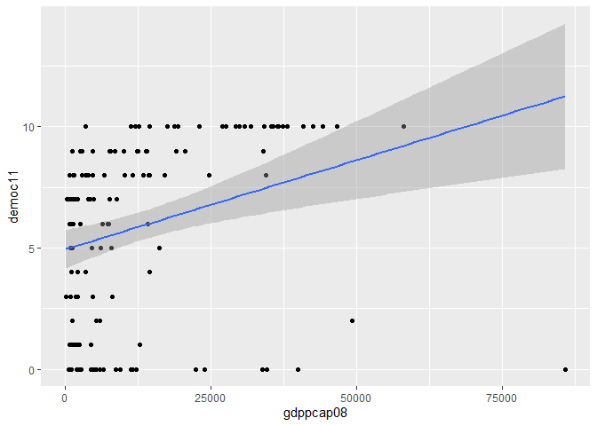
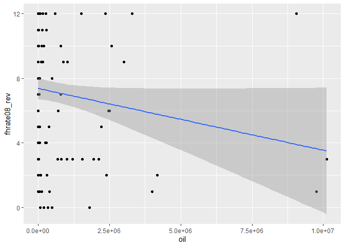
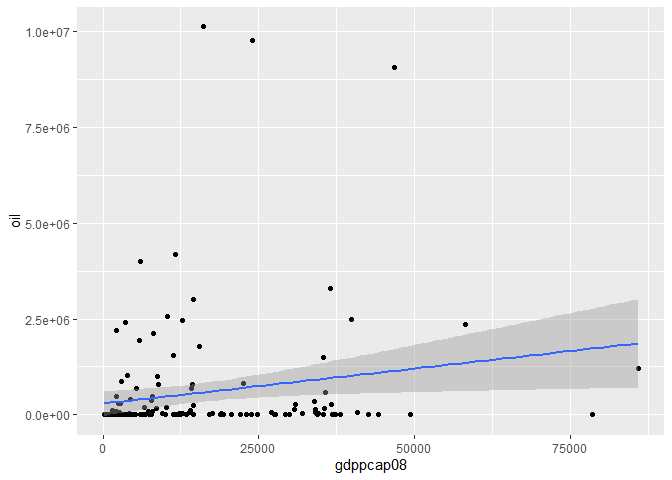

Exercicio 5
================
Alune

### Carregue o banco de dados `world` que está no pacote `poliscidata`.

``` r
library(poliscidata)
library(tidyverse)
```

    ## -- Attaching packages ------------------------------------------ tidyverse 1.3.0 --

    ## v ggplot2 3.3.2     v purrr   0.3.4
    ## v tibble  3.0.3     v dplyr   1.0.0
    ## v tidyr   1.1.0     v stringr 1.4.0
    ## v readr   1.3.1     v forcats 0.5.0

    ## -- Conflicts --------------------------------------------- tidyverse_conflicts() --
    ## x dplyr::filter() masks stats::filter()
    ## x dplyr::lag()    masks stats::lag()

``` r
library(ggbeeswarm)
banco <- world
```

### Existem diversas medidas de democracia para os países: `dem_score14`, `democ11`, `fhrate04_rev`, `fhrate08_rev`, `polity`. Descreva-as graficamente e diga quais são as diferenças entre tais medidas.

### RESPOSTA: ‘dem\_score14’ é uma variável numérica contínua que varia entre 0 e 10 na escala centesimal. A distribuição entre os países se deu de forma relativamente bem-distribuída e sua mediana ficou em torno de 5,7-5,9.

``` 
          'democ11' é uma variável númerica contínua que varia entre 0 e 10 na escala unitária. A distribuição se deu num formato similar ao de uma ampulheta cujo topo é maior que a base, indicando o maior número de casos acima de 5,0. A mediana ficou em torno de 6,4-6,6. 
          'fnrate04_rev'é uma variável numérica contínua que varia entre 1 e 7 em escala de 0,5. Essa variável mede o nível de democracia de forma invertida, enquanto os países mais democráticos pontuam 01, os menos democráticos pontuam 07; o que gerou uma distribuição mais larga no topo e menor na base, com o meio distribuído de forma não uniforme. A mediana ficou em torno de 4,3-4,5.
          'fnrate08_rev' é uma variável númerica contínua que varia entre 1 e 12 em escala unitária. De forma similar à variável anterior, ela também mede o nível de democracia de forma invertida, gerando um efeito similar (base mais fina e topo mais alargado). A diferença é que o meio está distribuído de forma mais uniforme (talvez devido à diminuição de classificações possíveis de 14 para 12 e o maior distanciamento entre elas - ao invés de 0,5 pontos de diferença, ela aumenta para 1 ponto).A mediana ficou entre 6,7-6,9.
          'polity'é uma variável numérica contínua que varia entre -10 e 10 em escala unitária. Surpreendentemente, o topo está bastante alargado, indicando que a maior parte da amostra é composta de democracias. A mediana ficou em torno de 5,0-5,3 .
```

``` r
ggplot(banco, aes("",dem_score14)) +
  geom_violin(draw_quantiles = c(0.25, 0.5, 0.75)) +
  geom_beeswarm()
```

<!-- -->

``` r
ggplot(banco, aes("",democ11)) +
  geom_violin(draw_quantiles = c(0.25, 0.5, 0.75)) +
  geom_beeswarm()
```

    ## Warning: Removed 23 rows containing non-finite values (stat_ydensity).

    ## Warning: Removed 23 rows containing missing values (position_beeswarm).

<!-- -->

``` r
ggplot(banco, aes("",fhrate04_rev)) +
  geom_violin(draw_quantiles = c(0.25, 0.5, 0.75)) +
  geom_beeswarm()
```

    ## Warning: Removed 14 rows containing non-finite values (stat_ydensity).

    ## Warning: Removed 14 rows containing missing values (position_beeswarm).

<!-- -->

``` r
ggplot(banco, aes("",fhrate08_rev)) +
  geom_violin(draw_quantiles = c(0.25, 0.5, 0.75)) +
  geom_beeswarm()
```

    ## Warning: Removed 15 rows containing non-finite values (stat_ydensity).

    ## Warning: Removed 15 rows containing missing values (position_beeswarm).

<!-- -->

``` r
ggplot(banco, aes("",polity)) +
  geom_violin(draw_quantiles = c(0.25, 0.5, 0.75)) +
  geom_beeswarm()
```

    ## Warning: Removed 23 rows containing non-finite values (stat_ydensity).

    ## Warning: Removed 23 rows containing missing values (position_beeswarm).

<!-- -->

### Avalie a relação entre todas as medidas de democracia e desigualdade, utilizando a variável `gini08`. Descreva graficamente esta variável, a relação entre as duas variáveis, meça a correlação entre elas e faça regressões lineares (interpretando em profundidade os resultados dos coeficientes e medidas de desempenho dos modelos). Enfatize as semelhanças e diferenças entre os resultados. Quais são suas conclusões?

### RESPOSTA:

### Para “dem\_score14”: Teste de Pearson mostrou significância estatística com p-valor = 0,015 e intervalo de confiança entre -0,382 e -0,043, indicando correlação 100% negativa (quando o índice de Gini sobe, o índice de democracia cai). Com relação à regressão linear, o p-valor deu bastante baixo para a variável “gini08” e 0,01 para “dem\_score14”, indicando que ambas as variáveis são relevantes para o modelo e que sua correlação é significativa. A regressão linear ainda mostra que o índice de Gini esperado quando “dem\_score14” for 0 é 47,03 (intercepto) e que o coeficiente angular é -1,08, novamente indicando correlação negativa. O R-quadrado ajustado deu 0,04 indicando que apenas 4% da variação é explicada pelo modelo.

### Para “democ11”: Teste de Pearson não mostrou significância estatística com p-valor = 0,367 e intervalo de confiança entre -0,263 e 0,099, indicando a ausência de correlação uma vez que esse intervalo compreende o número 0. Com relação à regressão linear, o p-valor deu bastante baixo para a variável “gini08” mas deu 0,368 para “democ11”, indicando que esta última variável não é relevante para o modelo. O R-quadrado ajustado deu 0,001 indicando que menos de 1% da variação é explicada pelo modelo, ressaltando a ausência de correlação e o p-valor alto.

### Para “fhrate04\_rev”: Teste de Pearson mostrou significância estatística no limite com p-valor = 0,049 e intervalo de confiança entre -0,345 e -0,0007, indicando correlação 100% negativa (quando o índice de Gini sobe, o índice de democracia cai). Com relação à regressão linear, o p-valor deu bastante baixo para a variável “gini08” e 0,049 para “fhrate04\_rev”, indicando que ambas as variáveis são relevantes para o modelo e que sua correlação é significativa, ainda que no limite. A regressão linear ainda mostra que o índice de Gini esperado quando “fhrate04\_rev” for 0 é 45,46 (intercepto) e que o coeficiente angular é -0,99, novamente indicando correlação negativa. O R-quadrado ajustado deu 0,02 indicando que apenas 2% da variação é explicada pelo modelo.

### Para “fhrate08\_rev”: Teste de Pearson não mostrou significância estatística com p-valor = 0,08 e intervalo de confiança entre -0,327 e 0,021, indicando ausência de correlação uma vez que esse intervalo compreende o número 0. Com relação à regressão linear, o p-valor deu bastante baixo para a variável “gini08” e mas deu 0,08 para “fhrate08\_rev”, indicando que esta última variável não é relevante para o modelo. A regressão linear ainda mostra que o índice de Gini esperado quando “fhrate08\_rev” for 0 é 44,045 (intercepto) e que o coeficiente angular é -0,4454. O R-quadrado ajustado deu 0,01 indicando que apenas 1% da variação é explicada pelo modelo, o que ressalta a ausência de correlação e o p-valor alto.

### Para “polity”: Teste de Pearson não mostrou significância estatística com p-valor = 0,665 e intervalo de confiança entre -0,434 e 0,143, indicando ausência de correlação uma vez que esse intervalo compreende o número 0. Com relação à regressão linear, o p-valor deu bastante baixo para a variável “gini08” e mas deu 0,665 para “polity”, indicando que esta última variável não é relevante para o modelo. A regressão linear ainda mostra que o índice de Gini esperado quando “polity” for 0 é 41,002 (intercepto) e que o coeficiente angular é 0,072, indicando a baixa inclinação da reta de regressão, muito próxima de 0, que por sua vez é o indicativo gráfico de total ausência de correlação. O R-quadrado ajustado deu -0,007 indicando que menos de 1% da variação é explicada pelo modelo, ressaltando a ausência de correlação e o p-valor alto.

### Percebe-se que em três das cinco amostras analisadas a variável utilizada para medir a democracia não é relevante para o modelo, resultando em baixa significância estatística. Ainda assim, nas duas amostras com p-valor estatísticamente significante, ressalta-se que o R-quadrado deu muito baixo, o que mostra o baixo poder de explicação do modelo mesmo nesses casos.

``` r
ggplot(banco, aes(gini08, dem_score14)) +
  geom_point() +
  geom_smooth(method = "lm")
```

    ## `geom_smooth()` using formula 'y ~ x'

    ## Warning: Removed 45 rows containing non-finite values (stat_smooth).

    ## Warning: Removed 45 rows containing missing values (geom_point).

<!-- -->

``` r
ggplot(banco, aes(gini08, democ11)) +
  geom_point() +
  geom_smooth(method = "lm")
```

    ## `geom_smooth()` using formula 'y ~ x'

    ## Warning: Removed 52 rows containing non-finite values (stat_smooth).

    ## Warning: Removed 52 rows containing missing values (geom_point).

<!-- -->

``` r
ggplot(banco, aes(gini08, fhrate04_rev)) +
  geom_point() +
  geom_smooth(method = "lm")
```

    ## `geom_smooth()` using formula 'y ~ x'

    ## Warning: Removed 45 rows containing non-finite values (stat_smooth).

    ## Warning: Removed 45 rows containing missing values (geom_point).

<!-- -->

``` r
ggplot(banco, aes(gini08, fhrate08_rev)) +
  geom_point() +
  geom_smooth(method = "lm")
```

    ## `geom_smooth()` using formula 'y ~ x'

    ## Warning: Removed 46 rows containing non-finite values (stat_smooth).

    ## Warning: Removed 46 rows containing missing values (geom_point).

<!-- -->

``` r
ggplot(banco, aes(gini08, polity)) +
  geom_point() +
  geom_smooth(method = "lm")
```

    ## `geom_smooth()` using formula 'y ~ x'

    ## Warning: Removed 52 rows containing non-finite values (stat_smooth).

    ## Warning: Removed 52 rows containing missing values (geom_point).

<!-- -->

``` r
cor.test(banco$gini08, banco$dem_score14)
```

    ## 
    ##  Pearson's product-moment correlation
    ## 
    ## data:  banco$gini08 and banco$dem_score14
    ## t = -2.4621, df = 120, p-value = 0.01523
    ## alternative hypothesis: true correlation is not equal to 0
    ## 95 percent confidence interval:
    ##  -0.38215203 -0.04321115
    ## sample estimates:
    ##        cor 
    ## -0.2192877

``` r
cor.test(banco$gini08, banco$democ11)
```

    ## 
    ##  Pearson's product-moment correlation
    ## 
    ## data:  banco$gini08 and banco$democ11
    ## t = -0.90439, df = 113, p-value = 0.3677
    ## alternative hypothesis: true correlation is not equal to 0
    ## 95 percent confidence interval:
    ##  -0.26378781  0.09988899
    ## sample estimates:
    ##         cor 
    ## -0.08477203

``` r
cor.test(banco$gini08, banco$fhrate04_rev)
```

    ## 
    ##  Pearson's product-moment correlation
    ## 
    ## data:  banco$gini08 and banco$fhrate04_rev
    ## t = -1.9869, df = 120, p-value = 0.04921
    ## alternative hypothesis: true correlation is not equal to 0
    ## 95 percent confidence interval:
    ##  -0.3452745300 -0.0007294745
    ## sample estimates:
    ##        cor 
    ## -0.1784673

``` r
cor.test(banco$gini08, banco$fhrate08_rev)
```

    ## 
    ##  Pearson's product-moment correlation
    ## 
    ## data:  banco$gini08 and banco$fhrate08_rev
    ## t = -1.7432, df = 119, p-value = 0.08387
    ## alternative hypothesis: true correlation is not equal to 0
    ## 95 percent confidence interval:
    ##  -0.32708386  0.02129614
    ## sample estimates:
    ##        cor 
    ## -0.1578002

``` r
cor.test(banco$gini08, banco$polity)
```

    ## 
    ##  Pearson's product-moment correlation
    ## 
    ## data:  banco$gini08 and banco$polity
    ## t = -0.43417, df = 113, p-value = 0.665
    ## alternative hypothesis: true correlation is not equal to 0
    ## 95 percent confidence interval:
    ##  -0.2222590  0.1433725
    ## sample estimates:
    ##         cor 
    ## -0.04080936

``` r
regressão_dem_score14 <- lm(gini08 ~ dem_score14, data = banco)
regressão_democ11 <- lm(gini08 ~ democ11, data = banco)
regressão_fhrate04_rev <- lm(gini08 ~ fhrate04_rev, data = banco)
regressão_fhrate08_rev <- lm(gini08 ~ fhrate08_rev, data = banco)
regressão_polity <- lm(gini08 ~ polity, data = banco)

summary(regressão_dem_score14)
```

    ## 
    ## Call:
    ## lm(formula = gini08 ~ dem_score14, data = banco)
    ## 
    ## Residuals:
    ##     Min      1Q  Median      3Q     Max 
    ## -15.669  -7.455  -1.785   5.316  34.010 
    ## 
    ## Coefficients:
    ##             Estimate Std. Error t value Pr(>|t|)    
    ## (Intercept)  47.0365     2.7447  17.137   <2e-16 ***
    ## dem_score14  -1.0811     0.4391  -2.462   0.0152 *  
    ## ---
    ## Signif. codes:  0 '***' 0.001 '**' 0.01 '*' 0.05 '.' 0.1 ' ' 1
    ## 
    ## Residual standard error: 9.877 on 120 degrees of freedom
    ##   (45 observations deleted due to missingness)
    ## Multiple R-squared:  0.04809,    Adjusted R-squared:  0.04015 
    ## F-statistic: 6.062 on 1 and 120 DF,  p-value: 0.01523

``` r
summary(regressão_democ11)
```

    ## 
    ## Call:
    ## lm(formula = gini08 ~ democ11, data = banco)
    ## 
    ## Residuals:
    ##     Min      1Q  Median      3Q     Max 
    ## -15.071  -7.211  -1.731   6.059  33.569 
    ## 
    ## Coefficients:
    ##             Estimate Std. Error t value Pr(>|t|)    
    ## (Intercept)  42.1711     1.9462  21.669   <2e-16 ***
    ## democ11      -0.2400     0.2654  -0.904    0.368    
    ## ---
    ## Signif. codes:  0 '***' 0.001 '**' 0.01 '*' 0.05 '.' 0.1 ' ' 1
    ## 
    ## Residual standard error: 9.826 on 113 degrees of freedom
    ##   (52 observations deleted due to missingness)
    ## Multiple R-squared:  0.007186,   Adjusted R-squared:  -0.0016 
    ## F-statistic: 0.8179 on 1 and 113 DF,  p-value: 0.3677

``` r
summary(regressão_fhrate04_rev)
```

    ## 
    ## Call:
    ## lm(formula = gini08 ~ fhrate04_rev, data = banco)
    ## 
    ## Residuals:
    ##     Min      1Q  Median      3Q     Max 
    ## -14.782  -7.653  -2.478   5.979  34.313 
    ## 
    ## Coefficients:
    ##              Estimate Std. Error t value Pr(>|t|)    
    ## (Intercept)   45.4619     2.5854  17.584   <2e-16 ***
    ## fhrate04_rev  -0.9955     0.5010  -1.987   0.0492 *  
    ## ---
    ## Signif. codes:  0 '***' 0.001 '**' 0.01 '*' 0.05 '.' 0.1 ' ' 1
    ## 
    ## Residual standard error: 9.961 on 120 degrees of freedom
    ##   (45 observations deleted due to missingness)
    ## Multiple R-squared:  0.03185,    Adjusted R-squared:  0.02378 
    ## F-statistic: 3.948 on 1 and 120 DF,  p-value: 0.04921

``` r
summary(regressão_fhrate08_rev)
```

    ## 
    ## Call:
    ## lm(formula = gini08 ~ fhrate08_rev, data = banco)
    ## 
    ## Residuals:
    ##     Min      1Q  Median      3Q     Max 
    ## -14.728  -7.801  -2.373   6.063  34.709 
    ## 
    ## Coefficients:
    ##              Estimate Std. Error t value Pr(>|t|)    
    ## (Intercept)   44.0459     2.1692  20.305   <2e-16 ***
    ## fhrate08_rev  -0.4454     0.2555  -1.743   0.0839 .  
    ## ---
    ## Signif. codes:  0 '***' 0.001 '**' 0.01 '*' 0.05 '.' 0.1 ' ' 1
    ## 
    ## Residual standard error: 10.03 on 119 degrees of freedom
    ##   (46 observations deleted due to missingness)
    ## Multiple R-squared:  0.0249, Adjusted R-squared:  0.01671 
    ## F-statistic: 3.039 on 1 and 119 DF,  p-value: 0.08387

``` r
summary(regressão_polity)
```

    ## 
    ## Call:
    ## lm(formula = gini08 ~ polity, data = banco)
    ## 
    ## Residuals:
    ##     Min      1Q  Median      3Q     Max 
    ## -15.576  -7.166  -1.566   6.056  33.734 
    ## 
    ## Coefficients:
    ##             Estimate Std. Error t value Pr(>|t|)    
    ## (Intercept) 41.00234    1.27543  32.148   <2e-16 ***
    ## polity      -0.07265    0.16732  -0.434    0.665    
    ## ---
    ## Signif. codes:  0 '***' 0.001 '**' 0.01 '*' 0.05 '.' 0.1 ' ' 1
    ## 
    ## Residual standard error: 9.853 on 113 degrees of freedom
    ##   (52 observations deleted due to missingness)
    ## Multiple R-squared:  0.001665,   Adjusted R-squared:  -0.007169 
    ## F-statistic: 0.1885 on 1 and 113 DF,  p-value: 0.665

### Avalie a relação entre todas as medidas de democracia e crescimento econômico, utilizando a variável `gdppcap08`. Descreva graficamente esta variável, a relação entre as duas variáveis, meça a correlação entre elas e faça regressões lineares (interpretando em profundidade os resultados dos coeficientes e medidas de desempenho dos modelos). Enfatize as semelhanças e diferenças entre os resultados. Quais são suas conclusões?

### RESPOSTA:

### Para “dem\_score14”: Teste de Pearson mostrou significância estatística com p-valor = 3.159e-11 (bastante baixo) e intervalo de confiança entre 0,376 e 0,615, indicando correlação 100% positiva (quando o PIB sobe, o índice de democracia sobe). Com relação à regressão linear, o p-valor deu 0,026 para a variável “gdppcap08” (baixo) e 3.16e-11 para “dem\_score14” (bastante baixo), indicando que ambas as variáveis são relevantes para o modelo e que sua correlação é bastante significativa. A regressão linear ainda mostra que o PIB per capita esperado quando “dem\_score14” for 0 é -6841,9 (intercepto) e que o coeficiente angular é 3626,7, resultado puramente estatístico uma vez que é impossível o PIB per capita ser negativo na realidade. O R-quadrado ajustado deu 0,25 indicando que 25% da variação é explicada pelo modelo.

### Para “democ11”: Teste de Pearson mostrou significância estatística com p-valor = 0.000435 (bastante baixo) e intervalo de confiança entre 0,133 e 0,435, indicando correlação 100% positiva (quando o PIB per capita sobe, o índice de democracia sobe). Com relação à regressão linear, o p-valor deu 0,005 para a variável “gdppcap08” (bastante baixo) e 0,0004 para “democ11” (basntante baixo), indicando que ambas as variáveis são relevantes para o modelo e que sua correlação é significativa. A regressão linear ainda mostra que o PIB per capita esperado quando “democ11” for 0 é 6351,6 (intercepto) e que o coeficiente angular é 1153,6, novamente indicando a correlação positiva. O R-quadrado ajustado deu 0,78 indicando que 78% da variação é explicada pelo modelo.

### Para “fhrate04\_rev”: Teste de Pearson mostrou significância estatística com p-valor = 1.331e-08 e intervalo de confiança entre 0,302 e 0,560, indicando correlação 100% positiva (quando o PIB per capita sobe, o índice de democracia sobe). Com relação à regressão linear, o p-valor deu 0,398 (alto) para a variável “gdppcap08” e 1.33e-08 para “fhrate04\_rev”. \[Não entendi porque esse p-valor deu alto\] A regressão linear ainda mostra que o PIB per capita esperado quando “fhrate04\_rev” for 0 é -2455,9 (intercepto) e que o coeficiente angular é 3502,7, resultado puramente estatístico uma vez que é impossível o PIB per capita ser negativo na realidade. O R-quadrado ajustado deu 0,18 indicando que 18% da variação é explicada pelo modelo.

### Para “fhrate08\_rev”: Teste de Pearson mostrou significância estatística com p-valor = 1.115e-08 e intervalo de confiança entre 0,306 e 0563, indicando correlação 100% positiva (quando o PIB per capita sobe, o índice de democracia sobe). Com relação à regressão linear, o p-valor deu 0,76 (bastante alto) para a variável “gdppcap08” mas deu 1.11e-08 para “fhrate08\_rev”, \[também não entendi porque esse p-valor deu alto\]. A regressão linear ainda mostra que o PIB per capita esperado quando “fhrate08\_rev” for 0 é 739,1 (intercepto) e que o coeficiente angular é 1796,8. O R-quadrado ajustado deu 0,19 indicando que 19% da variação é explicada pelo modelo.

### Para “polity”: Teste de Pearson mostrou significância estatística no limite com p-valor = 0,043 e intervalo de confiança entre 0,004 e 0,325, indicando correlação 100% positiva (quando o PIB per capita sobe, o índice de democracia sobe). Com relação à regressão linear, o p-valor deu 3.18e-12 (bastante baixo) para a variável “gdppcap08” e deu 0,04 para “polity”, indicando que ambas as variáveis são relevantes para o modelo e que sua correlação é relativamente significativa. A regressão linear ainda mostra que o PIB per capita esperado quando “polity” for 0 é 11416,1 (intercepto) e que o coeficiente angular é 407. No entanto, o R-quadrado ajustado deu 0,02 indicando que apenas 2% da variação é explicada pelo modelo.

### Percebe-se que em todas as cinco amostras a correlação foi estatisticamente significante e positiva, contudo a variável “polity” apresentou uma baixa capacidade de explicação da variação prevista no modelo, ao passo que a variável “democ11” conseguiria explicar 78% da variação.

``` r
ggplot(banco, aes(gdppcap08, dem_score14)) +
  geom_point() +
  geom_smooth(method = "lm")
```

    ## `geom_smooth()` using formula 'y ~ x'

    ## Warning: Removed 15 rows containing non-finite values (stat_smooth).

    ## Warning: Removed 15 rows containing missing values (geom_point).

<!-- -->

``` r
ggplot(banco, aes(gdppcap08, democ11)) +
  geom_point() +
  geom_smooth(method = "lm")
```

    ## `geom_smooth()` using formula 'y ~ x'

    ## Warning: Removed 25 rows containing non-finite values (stat_smooth).

    ## Warning: Removed 25 rows containing missing values (geom_point).

<!-- -->

``` r
ggplot(banco, aes(gdppcap08, fhrate04_rev)) +
  geom_point() +
  geom_smooth(method = "lm")
```

    ## `geom_smooth()` using formula 'y ~ x'

    ## Warning: Removed 15 rows containing non-finite values (stat_smooth).

    ## Warning: Removed 15 rows containing missing values (geom_point).

<!-- -->

``` r
ggplot(banco, aes(gdppcap08, fhrate08_rev)) +
  geom_point() +
  geom_smooth(method = "lm")
```

    ## `geom_smooth()` using formula 'y ~ x'

    ## Warning: Removed 16 rows containing non-finite values (stat_smooth).

    ## Warning: Removed 16 rows containing missing values (geom_point).

<!-- -->

``` r
ggplot(banco, aes(gdppcap08, polity)) +
  geom_point() +
  geom_smooth(method = "lm")
```

    ## `geom_smooth()` using formula 'y ~ x'

    ## Warning: Removed 25 rows containing non-finite values (stat_smooth).

    ## Warning: Removed 25 rows containing missing values (geom_point).

<!-- -->

``` r
cor.test(banco$gdppcap08, banco$dem_score14)
```

    ## 
    ##  Pearson's product-moment correlation
    ## 
    ## data:  banco$gdppcap08 and banco$dem_score14
    ## t = 7.1713, df = 150, p-value = 3.159e-11
    ## alternative hypothesis: true correlation is not equal to 0
    ## 95 percent confidence interval:
    ##  0.3763618 0.6150148
    ## sample estimates:
    ##       cor 
    ## 0.5052872

``` r
cor.test(banco$gdppcap08, banco$democ11)
```

    ## 
    ##  Pearson's product-moment correlation
    ## 
    ## data:  banco$gdppcap08 and banco$democ11
    ## t = 3.6037, df = 140, p-value = 0.000435
    ## alternative hypothesis: true correlation is not equal to 0
    ## 95 percent confidence interval:
    ##  0.1330147 0.4351981
    ## sample estimates:
    ##      cor 
    ## 0.291358

``` r
cor.test(banco$gdppcap08, banco$fhrate04_rev)
```

    ## 
    ##  Pearson's product-moment correlation
    ## 
    ## data:  banco$gdppcap08 and banco$fhrate04_rev
    ## t = 6.0129, df = 150, p-value = 1.331e-08
    ## alternative hypothesis: true correlation is not equal to 0
    ## 95 percent confidence interval:
    ##  0.3027442 0.5605748
    ## sample estimates:
    ##       cor 
    ## 0.4407043

``` r
cor.test(banco$gdppcap08, banco$fhrate08_rev)
```

    ## 
    ##  Pearson's product-moment correlation
    ## 
    ## data:  banco$gdppcap08 and banco$fhrate08_rev
    ## t = 6.0508, df = 149, p-value = 1.115e-08
    ## alternative hypothesis: true correlation is not equal to 0
    ## 95 percent confidence interval:
    ##  0.3061176 0.5638582
    ## sample estimates:
    ##     cor 
    ## 0.44413

``` r
cor.test(banco$gdppcap08, banco$polity)
```

    ## 
    ##  Pearson's product-moment correlation
    ## 
    ## data:  banco$gdppcap08 and banco$polity
    ## t = 2.0332, df = 140, p-value = 0.04392
    ## alternative hypothesis: true correlation is not equal to 0
    ## 95 percent confidence interval:
    ##  0.004758504 0.325013386
    ## sample estimates:
    ##      cor 
    ## 0.169353

``` r
regressão_dem_score14 <- lm(gdppcap08 ~ dem_score14, data = banco)
regressão_democ11 <- lm(gdppcap08 ~ democ11, data = banco)
regressão_fhrate04_rev <- lm(gdppcap08 ~ fhrate04_rev, data = banco)
regressão_fhrate08_rev <- lm(gdppcap08 ~ fhrate08_rev, data = banco)
regressão_polity <- lm(gdppcap08 ~ polity, data = banco)

summary(regressão_dem_score14)
```

    ## 
    ## Call:
    ## lm(formula = gdppcap08 ~ dem_score14, data = banco)
    ## 
    ## Residuals:
    ##    Min     1Q Median     3Q    Max 
    ## -18910  -9211  -2880   5955  81177 
    ## 
    ## Coefficients:
    ##             Estimate Std. Error t value Pr(>|t|)    
    ## (Intercept)  -6841.9     3049.3  -2.244   0.0263 *  
    ## dem_score14   3626.7      505.7   7.171 3.16e-11 ***
    ## ---
    ## Signif. codes:  0 '***' 0.001 '**' 0.01 '*' 0.05 '.' 0.1 ' ' 1
    ## 
    ## Residual standard error: 13380 on 150 degrees of freedom
    ##   (15 observations deleted due to missingness)
    ## Multiple R-squared:  0.2553, Adjusted R-squared:  0.2504 
    ## F-statistic: 51.43 on 1 and 150 DF,  p-value: 3.159e-11

``` r
summary(regressão_democ11)
```

    ## 
    ## Call:
    ## lm(formula = gdppcap08 ~ democ11, data = banco)
    ## 
    ## Residuals:
    ##    Min     1Q Median     3Q    Max 
    ## -15565  -9026  -4320   5131  79516 
    ## 
    ## Coefficients:
    ##             Estimate Std. Error t value Pr(>|t|)    
    ## (Intercept)   6351.6     2232.5   2.845 0.005106 ** 
    ## democ11       1153.6      320.1   3.604 0.000435 ***
    ## ---
    ## Signif. codes:  0 '***' 0.001 '**' 0.01 '*' 0.05 '.' 0.1 ' ' 1
    ## 
    ## Residual standard error: 14130 on 140 degrees of freedom
    ##   (25 observations deleted due to missingness)
    ## Multiple R-squared:  0.08489,    Adjusted R-squared:  0.07835 
    ## F-statistic: 12.99 on 1 and 140 DF,  p-value: 0.000435

``` r
summary(regressão_fhrate04_rev)
```

    ## 
    ## Call:
    ## lm(formula = gdppcap08 ~ fhrate04_rev, data = banco)
    ## 
    ## Residuals:
    ##    Min     1Q Median     3Q    Max 
    ## -18559  -9330  -3899   5337  79567 
    ## 
    ## Coefficients:
    ##              Estimate Std. Error t value Pr(>|t|)    
    ## (Intercept)   -2455.9     2898.1  -0.847    0.398    
    ## fhrate04_rev   3502.7      582.5   6.013 1.33e-08 ***
    ## ---
    ## Signif. codes:  0 '***' 0.001 '**' 0.01 '*' 0.05 '.' 0.1 ' ' 1
    ## 
    ## Residual standard error: 13920 on 150 degrees of freedom
    ##   (15 observations deleted due to missingness)
    ## Multiple R-squared:  0.1942, Adjusted R-squared:  0.1888 
    ## F-statistic: 36.16 on 1 and 150 DF,  p-value: 1.331e-08

``` r
summary(regressão_fhrate08_rev)
```

    ## 
    ## Call:
    ## lm(formula = gdppcap08 ~ fhrate08_rev, data = banco)
    ## 
    ## Residuals:
    ##    Min     1Q Median     3Q    Max 
    ## -19051  -8901  -3476   5603  79739 
    ## 
    ## Coefficients:
    ##              Estimate Std. Error t value Pr(>|t|)    
    ## (Intercept)     739.1     2418.8   0.306     0.76    
    ## fhrate08_rev   1796.8      296.9   6.051 1.11e-08 ***
    ## ---
    ## Signif. codes:  0 '***' 0.001 '**' 0.01 '*' 0.05 '.' 0.1 ' ' 1
    ## 
    ## Residual standard error: 13910 on 149 degrees of freedom
    ##   (16 observations deleted due to missingness)
    ## Multiple R-squared:  0.1973, Adjusted R-squared:  0.1919 
    ## F-statistic: 36.61 on 1 and 149 DF,  p-value: 1.115e-08

``` r
summary(regressão_polity)
```

    ## 
    ## Call:
    ## lm(formula = gdppcap08 ~ polity, data = banco)
    ## 
    ## Residuals:
    ##    Min     1Q Median     3Q    Max 
    ## -13910 -10214  -5142   3806  78522 
    ## 
    ## Coefficients:
    ##             Estimate Std. Error t value Pr(>|t|)    
    ## (Intercept)  11416.1     1495.1   7.636 3.18e-12 ***
    ## polity         407.0      200.2   2.033   0.0439 *  
    ## ---
    ## Signif. codes:  0 '***' 0.001 '**' 0.01 '*' 0.05 '.' 0.1 ' ' 1
    ## 
    ## Residual standard error: 14560 on 140 degrees of freedom
    ##   (25 observations deleted due to missingness)
    ## Multiple R-squared:  0.02868,    Adjusted R-squared:  0.02174 
    ## F-statistic: 4.134 on 1 and 140 DF,  p-value: 0.04392

### Avalie a relação entre todas as medidas de democracia e produção de petróleo, utilizando a variável `oil`. Descreva graficamente esta variável, a relação entre as duas variáveis, meça a correlação entre elas e faça regressões lineares (interpretando em profundidade os resultados dos coeficientes e medidas de desempenho dos modelos). Enfatize as semelhanças e diferenças entre os resultados. Quais são suas conclusões?

### RESPOSTA:

### Para “dem\_score14”: Teste de Pearson não mostrou significância estatística com p-valor = 0,104 e intervalo de confiança entre -0,274 e 0,026, indicando ausência de correlação uma vez que esse intervalo compreende o número 0. Com relação à regressão linear, o p-valor deu 0,0018 para a variável “oil” (baixo) e 0,104 para “dem\_score14”, indicando que esta última variável não é relevante para o modelo. A regressão linear ainda mostra que a produção de óleo esperada quando “dem\_score14” for 0 é 989268 (intercepto) e que o coeficiente angular é -85702. O R-quadrado ajustado deu 0,01 indicando que apenas 1% da variação é explicada pelo modelo, o que corrobora o p-valor alto e a baixa significância estatística da correlação.

### Para “democ11”: Teste de Pearson não mostrou significância estatística com p-valor = 0.087 e intervalo de confiança entre -0,299 e 0,021, indicando ausência de correlação uma vez que esse intervalo compreende o número 0. Com relação à regressão linear, o p-valor deu 0,00029 para a variável “oil” (bastante baixo) mas deu 0,087 para “democ11”, indicando que a última variável não é relevante para o modelo. A regressão linear ainda mostra que a produção de petróleo esperada quando “democ11” for 0 é 906830 (intercepto) e que o coeficiente angular é -59852. O R-quadrado ajustado deu 0,01 indicando que apenas 1% da variação é explicada pelo modelo, o que corrobora o p-valor alto e a baixa significância estatística da correlação.

### Para “fhrate04\_rev”: Teste de Pearson não mostrou significância estatística com p-valor = 0,0562 e intervalo de confiança entre -0,306 e 0,004, indicando ausência de correlação uma vez que esse intervalo compreende o número 0. Com relação à regressão linear, o p-valor deu 0,0006 (bastante baixo) para a variável “oil” e 0,0562 para “fhrate04\_rev”, indicando que a última variável não é relevante para o modelo. A regressão linear ainda mostra que a produção de petróleo esperada quando “fhrate04\_rev” for 0 é 1087527 (intercepto) e que o coeficiente angular é -121066. O R-quadrado ajustado deu 0,01 indicando que apenas 1% da variação é explicada pelo modelo, o que corrobora o p-valor alto e a baixa significância estatística da correlação.

### Para “fhrate08\_rev”: Teste de Pearson não mostrou significância estatística com p-valor = 0,062 e intervalo de confiança entre -0,304 e 0,007, indicando ausência de correlação uma vez que esse intervalo compreende o número 0. Com relação à regressão linear, o p-valor deu 0,00029 para a variável “oil” mas deu 0,0623 para “fhrate08\_rev”, indicando que a última variável não é relevante para o modelo. A regressão linear ainda mostra que a produção de petróleo esperada quando “fhrate08\_rev” for 0 é 971104 (intercepto) e que o coeficiente angular é -60455. O R-quadrado ajustado deu 0,01 indicando que apenas 1% da variação é explicada pelo modelo, o que corrobora o p-valor alto e a baixa significância estatística da correlação..

### Para “polity”: Teste de Pearson mostrou significância estatística com p-valor = 0,029 e intervalo de confiança entre -0,334 e -0,018, indicando correlação 100% negativa (quando a produção de petróleo sobe, o índice de democracia desce). Com relação à regressão linear, o p-valor deu 4.42e-06 (bastante baixo) para a variável “oil” e deu 0,0298 para “polity”, indicando que ambas as variáveis são relevantes para o modelo e que sua correlação é relativamente significativa.A regressão linear ainda mostra que a produção de petróleo esperada quando “polity” for 0 é 752068 (intercepto) e que o coeficiente angular é -46190, ressaltando a correlação negativa. No entanto, o R-quadrado ajustado deu 0,02 indicando que apenas 2% da variação é explicada pelo modelo.

### Percebe-se que em apenas uma amostra a correlação foi estatisticamente significante e negativa, contudo a variável “polity” apresentou uma baixa capacidade de explicação da variação prevista no modelo, De forma geral, há pouca ou nenhuma correlação entre produção de petróleo e nível de democracia.

``` r
ggplot(banco, aes(oil, dem_score14)) +
  geom_point() +
  geom_smooth(method = "lm")
```

    ## `geom_smooth()` using formula 'y ~ x'

    ## Warning: Removed 2 rows containing non-finite values (stat_smooth).

    ## Warning: Removed 2 rows containing missing values (geom_point).

<!-- -->

``` r
ggplot(banco, aes(oil, democ11)) +
  geom_point() +
  geom_smooth(method = "lm")
```

    ## `geom_smooth()` using formula 'y ~ x'

    ## Warning: Removed 23 rows containing non-finite values (stat_smooth).

    ## Warning: Removed 23 rows containing missing values (geom_point).

<!-- -->

``` r
ggplot(banco, aes(oil, fhrate04_rev)) +
  geom_point() +
  geom_smooth(method = "lm")
```

    ## `geom_smooth()` using formula 'y ~ x'

    ## Warning: Removed 15 rows containing non-finite values (stat_smooth).

    ## Warning: Removed 15 rows containing missing values (geom_point).

<!-- -->

``` r
ggplot(banco, aes(oil, fhrate08_rev)) +
  geom_point() +
  geom_smooth(method = "lm")
```

    ## `geom_smooth()` using formula 'y ~ x'

    ## Warning: Removed 16 rows containing non-finite values (stat_smooth).

    ## Warning: Removed 16 rows containing missing values (geom_point).

<!-- -->

``` r
ggplot(banco, aes(oil, polity)) +
  geom_point() +
  geom_smooth(method = "lm")
```

    ## `geom_smooth()` using formula 'y ~ x'

    ## Warning: Removed 23 rows containing non-finite values (stat_smooth).

    ## Warning: Removed 23 rows containing missing values (geom_point).

<!-- -->

``` r
cor.test(banco$oil, banco$dem_score14)
```

    ## 
    ##  Pearson's product-moment correlation
    ## 
    ## data:  banco$oil and banco$dem_score14
    ## t = -1.6344, df = 163, p-value = 0.1041
    ## alternative hypothesis: true correlation is not equal to 0
    ## 95 percent confidence interval:
    ##  -0.27443572  0.02631799
    ## sample estimates:
    ##        cor 
    ## -0.1269762

``` r
cor.test(banco$oil, banco$democ11)
```

    ## 
    ##  Pearson's product-moment correlation
    ## 
    ## data:  banco$oil and banco$democ11
    ## t = -1.718, df = 142, p-value = 0.08798
    ## alternative hypothesis: true correlation is not equal to 0
    ## 95 percent confidence interval:
    ##  -0.29928445  0.02138076
    ## sample estimates:
    ##        cor 
    ## -0.1426942

``` r
cor.test(banco$oil, banco$fhrate04_rev)
```

    ## 
    ##  Pearson's product-moment correlation
    ## 
    ## data:  banco$oil and banco$fhrate04_rev
    ## t = -1.9244, df = 150, p-value = 0.0562
    ## alternative hypothesis: true correlation is not equal to 0
    ## 95 percent confidence interval:
    ##  -0.306837012  0.004083069
    ## sample estimates:
    ##        cor 
    ## -0.1552185

``` r
cor.test(banco$oil, banco$fhrate08_rev)
```

    ## 
    ##  Pearson's product-moment correlation
    ## 
    ## data:  banco$oil and banco$fhrate08_rev
    ## t = -1.8779, df = 149, p-value = 0.06235
    ## alternative hypothesis: true correlation is not equal to 0
    ## 95 percent confidence interval:
    ##  -0.304387817  0.007867529
    ## sample estimates:
    ##       cor 
    ## -0.152052

``` r
cor.test(banco$oil, banco$polity)
```

    ## 
    ##  Pearson's product-moment correlation
    ## 
    ## data:  banco$oil and banco$polity
    ## t = -2.195, df = 142, p-value = 0.02979
    ## alternative hypothesis: true correlation is not equal to 0
    ## 95 percent confidence interval:
    ##  -0.33480603 -0.01811182
    ## sample estimates:
    ##        cor 
    ## -0.1811511

``` r
regressão_dem_score14 <- lm(oil ~ dem_score14, data = banco)
regressão_democ11 <- lm(oil ~ democ11, data = banco)
regressão_fhrate04_rev <- lm(oil ~ fhrate04_rev, data = banco)
regressão_fhrate08_rev <- lm(oil ~ fhrate08_rev, data = banco)
regressão_polity <- lm(oil ~ polity, data = banco)

summary(regressão_dem_score14)
```

    ## 
    ## Call:
    ## lm(formula = oil ~ dem_score14, data = banco)
    ## 
    ## Residuals:
    ##     Min      1Q  Median      3Q     Max 
    ## -896592 -550473 -409266 -206660 9421262 
    ## 
    ## Coefficients:
    ##             Estimate Std. Error t value Pr(>|t|)   
    ## (Intercept)   989268     313084   3.160  0.00188 **
    ## dem_score14   -85702      52438  -1.634  0.10411   
    ## ---
    ## Signif. codes:  0 '***' 0.001 '**' 0.01 '*' 0.05 '.' 0.1 ' ' 1
    ## 
    ## Residual standard error: 1469000 on 163 degrees of freedom
    ##   (2 observations deleted due to missingness)
    ## Multiple R-squared:  0.01612,    Adjusted R-squared:  0.01009 
    ## F-statistic: 2.671 on 1 and 163 DF,  p-value: 0.1041

``` r
summary(regressão_democ11)
```

    ## 
    ## Call:
    ## lm(formula = oil ~ democ11, data = banco)
    ## 
    ## Residuals:
    ##     Min      1Q  Median      3Q     Max 
    ## -906830 -547718 -368163 -241953 9512430 
    ## 
    ## Coefficients:
    ##             Estimate Std. Error t value Pr(>|t|)    
    ## (Intercept)   906830     244095   3.715 0.000291 ***
    ## democ11       -59852      34839  -1.718 0.087980 .  
    ## ---
    ## Signif. codes:  0 '***' 0.001 '**' 0.01 '*' 0.05 '.' 0.1 ' ' 1
    ## 
    ## Residual standard error: 1546000 on 142 degrees of freedom
    ##   (23 observations deleted due to missingness)
    ## Multiple R-squared:  0.02036,    Adjusted R-squared:  0.01346 
    ## F-statistic: 2.951 on 1 and 142 DF,  p-value: 0.08798

``` r
summary(regressão_fhrate04_rev)
```

    ## 
    ## Call:
    ## lm(formula = oil ~ fhrate04_rev, data = banco)
    ## 
    ## Residuals:
    ##     Min      1Q  Median      3Q     Max 
    ## -918120 -603261 -361128 -181882 9335139 
    ## 
    ## Coefficients:
    ##              Estimate Std. Error t value Pr(>|t|)    
    ## (Intercept)   1087527     312415   3.481 0.000654 ***
    ## fhrate04_rev  -121066      62913  -1.924 0.056203 .  
    ## ---
    ## Signif. codes:  0 '***' 0.001 '**' 0.01 '*' 0.05 '.' 0.1 ' ' 1
    ## 
    ## Residual standard error: 1509000 on 150 degrees of freedom
    ##   (15 observations deleted due to missingness)
    ## Multiple R-squared:  0.02409,    Adjusted R-squared:  0.01759 
    ## F-statistic: 3.703 on 1 and 150 DF,  p-value: 0.0562

``` r
summary(regressão_fhrate08_rev)
```

    ## 
    ## Call:
    ## lm(formula = oil ~ fhrate08_rev, data = banco)
    ## 
    ## Residuals:
    ##     Min      1Q  Median      3Q     Max 
    ## -910650 -608377 -366559 -197000 9330259 
    ## 
    ## Coefficients:
    ##              Estimate Std. Error t value Pr(>|t|)    
    ## (Intercept)    971104     261709   3.711 0.000291 ***
    ## fhrate08_rev   -60455      32193  -1.878 0.062354 .  
    ## ---
    ## Signif. codes:  0 '***' 0.001 '**' 0.01 '*' 0.05 '.' 0.1 ' ' 1
    ## 
    ## Residual standard error: 1514000 on 149 degrees of freedom
    ##   (16 observations deleted due to missingness)
    ## Multiple R-squared:  0.02312,    Adjusted R-squared:  0.01656 
    ## F-statistic: 3.526 on 1 and 149 DF,  p-value: 0.06235

``` r
summary(regressão_polity)
```

    ## 
    ## Call:
    ## lm(formula = oil ~ polity, data = banco)
    ## 
    ## Residuals:
    ##      Min       1Q   Median       3Q      Max 
    ## -1167777  -516818  -363383  -226603  9552692 
    ## 
    ## Coefficients:
    ##             Estimate Std. Error t value Pr(>|t|)    
    ## (Intercept)   752068     157494   4.775 4.42e-06 ***
    ## polity        -46190      21044  -2.195   0.0298 *  
    ## ---
    ## Signif. codes:  0 '***' 0.001 '**' 0.01 '*' 0.05 '.' 0.1 ' ' 1
    ## 
    ## Residual standard error: 1536000 on 142 degrees of freedom
    ##   (23 observations deleted due to missingness)
    ## Multiple R-squared:  0.03282,    Adjusted R-squared:  0.026 
    ## F-statistic: 4.818 on 1 and 142 DF,  p-value: 0.02979

### Avalie a relação entre crescimento econômico e produção de petróleo. Descreva a relação entre as duas variáveis, meça a correlação entre elas e faça regressões lineares (interpretando em profundidade os resultados dos coeficientes e medidas de desempenho dos modelos). Enfatize as semelhanças e diferenças entre os resultados. Quais são suas conclusões?

### RESPOSTA:

### Teste de Pearson mostrou significância estatística com p-valor = 0,0225 e intervalo de confiança entre 0,026 e 0,335, indicando correlação 100% positiva (quando a produção de petróleo sobe, o PIB per capita sobe). Com relação à regressão linear, o p-valor deu 2e-16 (bastante baixo) para a variável “gdppcap08” e deu 0,0225 para “oil” (consideravelemnte baixo), indicando que ambas as variáveis são relevantes para o modelo e que sua correlação é consideravelmente significativa. A regressão linear ainda mostra que o PIB per capita esperado quando “oil” for 0 é 1.262e+04 (intercepto) e que o coeficiente angular é 1.884e-03, ressaltando a correlação positiva. No entanto, o R-quadrado ajustado deu 0,02 indicando que apenas 2% da variação é explicada pelo modelo. Conclui-se que, apesar de estatisticamente significante, a correlação tem pouco poder expliativo, o que indica a existência de outras variáveis colaterais que também impactam na relação entre as duas variáveis destacadas.

``` r
ggplot(banco, aes(gdppcap08, oil)) +
  geom_point() +
  geom_smooth(method = "lm")
```

    ## `geom_smooth()` using formula 'y ~ x'

    ## Warning: Removed 16 rows containing non-finite values (stat_smooth).

    ## Warning: Removed 16 rows containing missing values (geom_point).

<!-- -->

``` r
cor.test(banco$gdppcap08, banco$oil)
```

    ## 
    ##  Pearson's product-moment correlation
    ## 
    ## data:  banco$gdppcap08 and banco$oil
    ## t = 2.3051, df = 149, p-value = 0.02254
    ## alternative hypothesis: true correlation is not equal to 0
    ## 95 percent confidence interval:
    ##  0.02661893 0.33534756
    ## sample estimates:
    ##       cor 
    ## 0.1855584

``` r
regressão_PIB_petróleo <- lm(gdppcap08 ~ oil, data = banco)

summary(regressão_PIB_petróleo)
```

    ## 
    ## Call:
    ## lm(formula = gdppcap08 ~ oil, data = banco)
    ## 
    ## Residuals:
    ##    Min     1Q Median     3Q    Max 
    ## -15541 -10735  -6347   6549  70967 
    ## 
    ## Coefficients:
    ##              Estimate Std. Error t value Pr(>|t|)    
    ## (Intercept) 1.262e+04  1.319e+03   9.566   <2e-16 ***
    ## oil         1.884e-03  8.173e-04   2.305   0.0225 *  
    ## ---
    ## Signif. codes:  0 '***' 0.001 '**' 0.01 '*' 0.05 '.' 0.1 ' ' 1
    ## 
    ## Residual standard error: 15280 on 149 degrees of freedom
    ##   (16 observations deleted due to missingness)
    ## Multiple R-squared:  0.03443,    Adjusted R-squared:  0.02795 
    ## F-statistic: 5.313 on 1 and 149 DF,  p-value: 0.02254

### A partir das suas conclusões sobre a relação entre democracia, economia e produção de petróleo, quais considerações são possíveis fazer sobre a relação CAUSAL entre estas variáveis? Lembre dos 4 “hurdles” do livro *Fundamentals of Political Science Research*

### RESPOSTA: Sobre a relação entre democracia e índice de gini: é possível imaginar que democracias mais bem estabelecidas tenham menos desigualdade, devido ao melhor funcionamento das instituições e dos serviços públicos(sim para o primeiro “hurdle”). A possibilidade de desigualdade “causar” democracia não pode ser descartada (não para o segundo “hurdle”). A covariação existiu em três das cinco amostras testadas, o que permite afirmar que sim, há covariação a depender da forma como construímos a variável “democracia” (sim para o terceiro “hurdle”). Por fim, como o teste do R-quadrado demonstrou, não é só possível como provável que outras variáveis colineares também impactem na variação entre as variáveis destacadas (não para o quarto “hurdle”).

### Sobre a relação entre democracia e PIB per capita: é possível imaginar que democracias mais bem estabelecidas tenham PIB per capita mais altos, devido à estabilidade institucional, por exemplo, que pode auxiliar na estabilidade e no desenvolvimento econômicos (sim para o primeiro “hurdle”). A possibilidade de desenvolvimento econômico causar democracia não pode ser descartada (não para o segundo “hurdle”). A covariação existiu em todas as 5 amostras testadas (sim para o terceiro “hurdle”). Por fim, apesar do maior poder explicativo desse modelo, ainda é plenamente possível que outras variáveis colineares impactem no resultado (não para o quarto “hurdle”).

### Sobre a relação entre produção de petróleo e democracia: forçando um pouco a barra, seria possível afirmar que países com alta produção de petróleo tendem a ser mais autocráticos, devido à localização geográfica (muitos estão localizados no Oriente Médio ou no Norte da África), òu à fortes pressões externas e internas pelo controle dos recursos naturais, o que pode estimular lideranças mais autoritárias e centralizadoras (sim para o primeiro “hurdle”). Não é logicamente possível afirmar que a democracia “cause” alta produção de petróleo porque este é um recurso natural pré-existente no solo (sim para o segundo “hurdle”). Os testes mostraram a ausência ou fraqueza de covariação entre a produção de petróleo e o nível da democracia (não para o terceiro “hurdle”). Por fim, é possível que variáveis colineares tenham impactado nesse resultado (não para o quarto “hurdle”).

### Sobre a relação entre desenvolvimento econômico e produção de petróleo: é possível pensar que grandes produtores de petróleo tenham um maior PIB per capita devido às riquezas geradas pelo recurso natural (sim para o primeiro “hurdle”). Não é logicamente possível afirmar que o desenvolvimento econômico vai “causar” a produção de petróleo porque este é um recurso natural pré-existente no solo (sim para o segundo “hurdle”). O teste mostrou a existência de covariação entre as variáveis (sim para o terceiro “hurdle”). Contudo, o r-quadrado mostrou a baixa caapcidade de explicação do modelo, o que pode sugerir a existência de outras variáveis colineares (não para o quarto “hurdle”).
