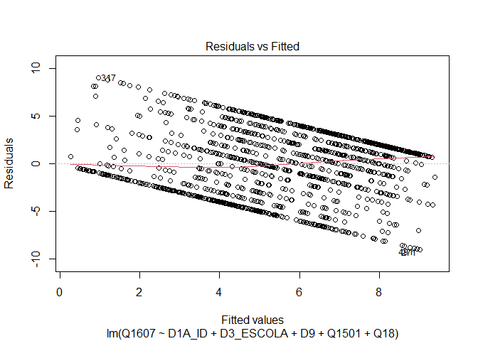
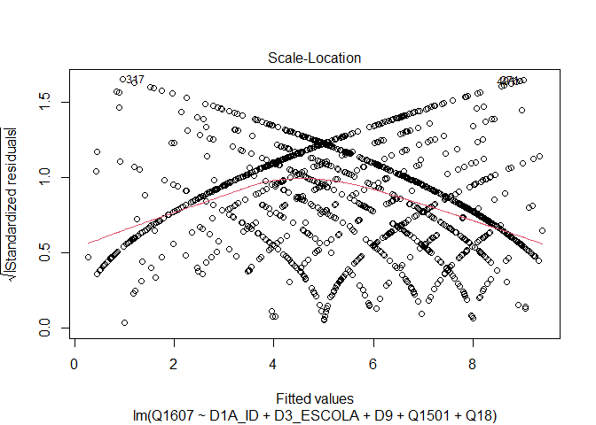
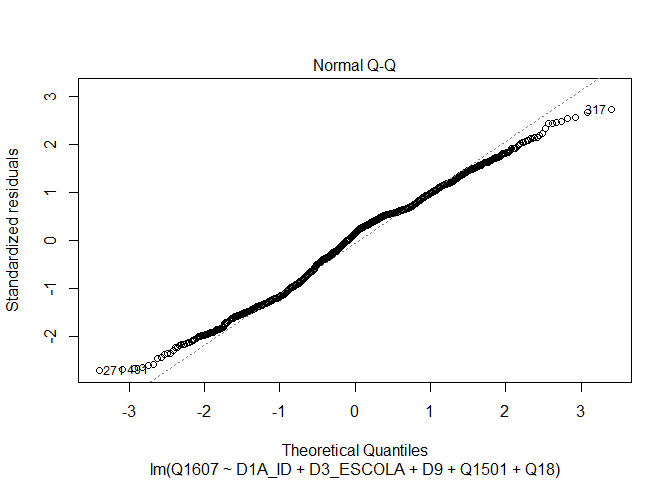

Exercicio 7 Victor Santos
================
Alune

### No exercício anterior foram feitos alguns modelos bivariados. Agora faça uma regressão multivariada mostrando como a nota atribuída a Jair Bolsonaro (variável Q1607) pode ser explicada pelas variáveis idade (D1A\_ID), educação (D3\_ESCOLA), renda (D9), nota atribuída ao PT (Q1501) e auto-atribuição ideológica (Q18) dos respondentes. Interprete o resultado a partir das informações dadas pelo sumário da regressão.

RESPOSTA: as variáveis idade e renda não foram estatisticamente
significantes, ao passo que educação, nota atribuída ao PT e
autoavaliação ideológica deram relevÂncia estatística muito alta,
sobretudo estas duas últimas. O R-quadrado deu 0.28, o que indica que
28% da variação da pontuação dada à Bolsonaro pelos entrevistados pode
ser explicado pela fórmula multivariada desenvolvida. Com relação às
variáveis estatisticamente significantes, a correlação foi negativa para
escolaridade e nota atribuída ao PT (ou seja, quanto maior a
escolaridade e a nota atribuída ao PT, menor a avaliação de Bolsonaro);
ao passo que a variável ideologia deu uma correlação positiva (quanto
maior na escala de 0-10, ou seja mais próximo da extrema-direita, maior
a avaliação de Bolsonaro).Nota-se também que o erro padrão dos resíduos
deu relativamente alto (considerando que a escala é de 0-10), o que pode
indicar um baixo ajuste do modelo à amostra.

``` r
library(tidyverse)
library(haven)

read_sav("04622.sav")
```

    ## # A tibble: 2,506 x 286
    ##    A1_Nquest DIAENTR  MESENTR ANOENTR D1A_ID D1A_FAIXAID D2_SEXO D3_ESCOLA
    ##        <dbl>   <dbl> <dbl+lb>   <dbl>  <dbl>   <dbl+lbl> <dbl+l> <dbl+lbl>
    ##  1         1      15 11 [Nov~    2018     41 4 [35 A 44] 2 [Fem~ 5 [Coleg~
    ##  2         2      15 11 [Nov~    2018     23 2 [18 A 24] 1 [Mas~ 5 [Coleg~
    ##  3         3      15 11 [Nov~    2018     21 2 [18 A 24] 2 [Fem~ 6 [Coleg~
    ##  4         4      16 11 [Nov~    2018     39 4 [35 A 44] 1 [Mas~ 3 [Ginás~
    ##  5         5      16 11 [Nov~    2018     64 6 [55 A 64] 1 [Mas~ 0 [Analf~
    ##  6         6      16 11 [Nov~    2018     45 5 [45 A 54] 2 [Fem~ 0 [Analf~
    ##  7         7      16 11 [Nov~    2018     18 2 [18 A 24] 2 [Fem~ 4 [Ginás~
    ##  8         8      17 11 [Nov~    2018     29 3 [25 A 34] 1 [Mas~ 8 [Ensin~
    ##  9         9      17 11 [Nov~    2018     25 3 [25 A 34] 2 [Fem~ 8 [Ensin~
    ## 10        10      17 11 [Nov~    2018     31 3 [25 A 34] 1 [Mas~ 6 [Coleg~
    ## # ... with 2,496 more rows, and 278 more variables: RAMOATIV <dbl+lbl>,
    ## #   RAMOCHEFEF <dbl+lbl>, OCUPA <dbl+lbl>, UF <dbl+lbl>, CID <dbl+lbl>,
    ## #   REG <dbl+lbl>, Q1 <dbl+lbl>, Q2 <dbl+lbl>, Q3 <dbl+lbl>, Q401 <dbl+lbl>,
    ## #   Q402 <dbl+lbl>, Q403 <dbl+lbl>, Q404 <dbl+lbl>, Q405 <dbl+lbl>,
    ## #   Q406 <dbl+lbl>, Q407 <dbl+lbl>, Q501 <dbl+lbl>, Q502 <dbl+lbl>,
    ## #   Q503 <dbl+lbl>, Q504 <dbl+lbl>, Q505 <dbl+lbl>, Q601 <dbl+lbl>,
    ## #   Q602 <dbl+lbl>, Q603 <dbl+lbl>, Q604 <dbl+lbl>, Q7 <dbl+lbl>, Q8 <dbl+lbl>,
    ## #   Q9 <dbl+lbl>, Q10A <dbl+lbl>, Q10B <dbl+lbl>, Q11 <dbl+lbl>,
    ## #   Q12P1_A <dbl+lbl>, Q12P1_B <dbl+lbl>, Q12P2_A <dbl+lbl>, Q12P2_B <dbl+lbl>,
    ## #   Q12G_1A <dbl+lbl>, Q12G_2 <dbl+lbl>, Q12S1 <dbl+lbl>, Q12S2 <dbl+lbl>,
    ## #   Q12CD <dbl+lbl>, Q12CD_recode <dbl+lbl>, Q12AL <dbl+lbl>,
    ## #   Q12AL_recode <dbl+lbl>, Q13A <dbl+lbl>, Q13B <dbl+lbl>, Q13B_2 <dbl+lbl>,
    ## #   Q13B2A <dbl+lbl>, Q13G1 <dbl+lbl>, Q13G2 <dbl+lbl>, Q13S <dbl+lbl>,
    ## #   Q13CD <dbl+lbl>, Q13CD_recode <dbl+lbl>, Q13AL <dbl+lbl>,
    ## #   Q13AL_recode <dbl+lbl>, Q14A <dbl+lbl>, Q14B <dbl+lbl>, Q1501 <dbl+lbl>,
    ## #   Q1502 <dbl+lbl>, Q1503 <dbl+lbl>, Q1504 <dbl+lbl>, Q1505 <dbl+lbl>,
    ## #   Q1506 <dbl+lbl>, Q1507 <dbl+lbl>, Q1508 <dbl+lbl>, Q1509 <dbl+lbl>,
    ## #   Q1510 <dbl+lbl>, Q1511 <dbl+lbl>, Q1512 <dbl+lbl>, Q1513 <dbl+lbl>,
    ## #   Q1514 <dbl+lbl>, Q1515 <dbl+lbl>, Q1516 <dbl+lbl>, Q1517 <dbl+lbl>,
    ## #   Q1518 <dbl+lbl>, Q1519 <dbl+lbl>, Q1520 <dbl+lbl>, Q1521 <dbl+lbl>,
    ## #   Q1522 <dbl+lbl>, Q1523 <dbl+lbl>, Q1524 <dbl+lbl>, Q1525 <dbl+lbl>,
    ## #   Q1526 <dbl+lbl>, Q1601 <dbl+lbl>, Q1602 <dbl+lbl>, Q1603 <dbl+lbl>,
    ## #   Q1604 <dbl+lbl>, Q1605 <dbl+lbl>, Q1606 <dbl+lbl>, Q1607 <dbl+lbl>,
    ## #   Q1608 <dbl+lbl>, Q1609 <dbl+lbl>, Q1610 <dbl+lbl>, Q1611 <dbl+lbl>,
    ## #   Q1612 <dbl+lbl>, Q1613 <dbl+lbl>, Q1614 <dbl+lbl>, Q1615 <dbl+lbl>,
    ## #   Q1616 <dbl+lbl>, Q1617 <dbl+lbl>, Q1618 <dbl+lbl>, ...

``` r
banco_1 <- read_sav("04622.sav")

banco_novo <- banco_1 %>% select(Q1607, D1A_ID, D3_ESCOLA, Q1501, Q18, D9) %>%
  filter(Q1607 <= 10, Q1501 <= 10, Q18 <= 10, D9 <= 999997) %>%
  mutate(Q1607 = as.numeric(Q1607))

regressão_multivariada_01 <- lm(Q1607 ~ D1A_ID + D3_ESCOLA + D9 + Q1501 + Q18, data = banco_novo)

summary(regressão_multivariada_01)
```

    ## 
    ## Call:
    ## lm(formula = Q1607 ~ D1A_ID + D3_ESCOLA + D9 + Q1501 + Q18, data = banco_novo)
    ## 
    ## Residuals:
    ##     Min      1Q  Median      3Q     Max 
    ## -9.0176 -2.5841  0.4915  2.1784  9.0477 
    ## 
    ## Coefficients:
    ##               Estimate Std. Error t value Pr(>|t|)    
    ## (Intercept)  5.743e+00  4.768e-01  12.044  < 2e-16 ***
    ## D1A_ID       5.816e-03  6.216e-03   0.936  0.34968    
    ## D3_ESCOLA   -1.543e-01  4.469e-02  -3.453  0.00057 ***
    ## D9          -3.067e-05  2.793e-05  -1.098  0.27230    
    ## Q1501       -4.154e-01  2.359e-02 -17.608  < 2e-16 ***
    ## Q18          3.244e-01  2.627e-02  12.349  < 2e-16 ***
    ## ---
    ## Signif. codes:  0 '***' 0.001 '**' 0.01 '*' 0.05 '.' 0.1 ' ' 1
    ## 
    ## Residual standard error: 3.336 on 1456 degrees of freedom
    ## Multiple R-squared:  0.2831, Adjusted R-squared:  0.2806 
    ## F-statistic:   115 on 5 and 1456 DF,  p-value: < 2.2e-16

### Em que medida os resultados se mantém ou se alteram quando comparados com os resultados do exercício anterior, quando foram utilizadas apenas regressões bivariadas?

RESPOSTA: Os resultados deram bastante diferentes no geral. A variável
idade deu considerável significância estatística na regressão bivariada,
ao contrário da multivariada. A variável renda continuou não
estatisticamente significante mas o p-valor decaiu bastante. O p-valor
da variável educação também caiu, apesar dela também ser relativamente
significante na forma bivariada. Todos os coeficientes de inclinação
(com exceção do da variável renda, que já era muito baixo já regressão
bivariada) caíram bastante, o que pode indicar um balanceamento dos
efeitos à medida que vamos inserindo mais variáveis em conjunto à
fórmula. As variáveis ideologia e avaliação do PT continuaram com
p-valor bastante baixo e alta significância, ainda que o coeficiente
tenha se reduzido consideravelmente.

``` r
regressão_idade_bolsonaro <- lm(Q1607 ~ D1A_ID, data = banco_novo)
regressão_educação_bolsonaro <- lm(Q1607 ~ D3_ESCOLA, data = banco_novo)
regressão_renda_bolsonaro <- lm(Q1607 ~ D9, data = banco_novo)
regressão_PT_bolsonaro <- lm(Q1607 ~ Q1501, data = banco_novo)
regressão_ideologia_bolsonaro <- lm(Q1607 ~ Q18, data = banco_novo)

summary(regressão_idade_bolsonaro)
```

    ## 
    ## Call:
    ## lm(formula = Q1607 ~ D1A_ID, data = banco_novo)
    ## 
    ## Residuals:
    ##     Min      1Q  Median      3Q     Max 
    ## -6.5423 -4.3924  0.7616  3.8889  4.8334 
    ## 
    ## Coefficients:
    ##             Estimate Std. Error t value Pr(>|t|)    
    ## (Intercept) 4.838056   0.293850  16.464  < 2e-16 ***
    ## D1A_ID      0.020533   0.006716   3.057  0.00228 ** 
    ## ---
    ## Signif. codes:  0 '***' 0.001 '**' 0.01 '*' 0.05 '.' 0.1 ' ' 1
    ## 
    ## Residual standard error: 3.922 on 1460 degrees of freedom
    ## Multiple R-squared:  0.006361,   Adjusted R-squared:  0.00568 
    ## F-statistic: 9.346 on 1 and 1460 DF,  p-value: 0.002276

``` r
summary(regressão_educação_bolsonaro)
```

    ## 
    ## Call:
    ## lm(formula = Q1607 ~ D3_ESCOLA, data = banco_novo)
    ## 
    ## Residuals:
    ##     Min      1Q  Median      3Q     Max 
    ## -6.2467 -4.4520  0.7183  3.9804  4.7751 
    ## 
    ## Coefficients:
    ##             Estimate Std. Error t value Pr(>|t|)    
    ## (Intercept)  6.24666    0.25251  24.739   <2e-16 ***
    ## D3_ESCOLA   -0.11352    0.04621  -2.457   0.0141 *  
    ## ---
    ## Signif. codes:  0 '***' 0.001 '**' 0.01 '*' 0.05 '.' 0.1 ' ' 1
    ## 
    ## Residual standard error: 3.926 on 1460 degrees of freedom
    ## Multiple R-squared:  0.004117,   Adjusted R-squared:  0.003435 
    ## F-statistic: 6.036 on 1 and 1460 DF,  p-value: 0.01413

``` r
summary(regressão_renda_bolsonaro)
```

    ## 
    ## Call:
    ## lm(formula = Q1607 ~ D9, data = banco_novo)
    ## 
    ## Residuals:
    ##     Min      1Q  Median      3Q     Max 
    ## -6.1384 -4.6616  0.3444  4.3065  4.3479 
    ## 
    ## Coefficients:
    ##              Estimate Std. Error t value Pr(>|t|)    
    ## (Intercept) 5.651e+00  1.338e-01  42.227   <2e-16 ***
    ## D9          1.059e-05  3.153e-05   0.336    0.737    
    ## ---
    ## Signif. codes:  0 '***' 0.001 '**' 0.01 '*' 0.05 '.' 0.1 ' ' 1
    ## 
    ## Residual standard error: 3.934 on 1460 degrees of freedom
    ## Multiple R-squared:  7.729e-05,  Adjusted R-squared:  -0.0006076 
    ## F-statistic: 0.1129 on 1 and 1460 DF,  p-value: 0.737

``` r
summary(regressão_PT_bolsonaro)
```

    ## 
    ## Call:
    ## lm(formula = Q1607 ~ Q1501, data = banco_novo)
    ## 
    ## Residuals:
    ##     Min      1Q  Median      3Q     Max 
    ## -7.3753 -2.9482  0.6247  2.6247  7.0518 
    ## 
    ## Coefficients:
    ##             Estimate Std. Error t value Pr(>|t|)    
    ## (Intercept)  7.37535    0.13069   56.43   <2e-16 ***
    ## Q1501       -0.44271    0.02406  -18.40   <2e-16 ***
    ## ---
    ## Signif. codes:  0 '***' 0.001 '**' 0.01 '*' 0.05 '.' 0.1 ' ' 1
    ## 
    ## Residual standard error: 3.544 on 1460 degrees of freedom
    ## Multiple R-squared:  0.1883, Adjusted R-squared:  0.1877 
    ## F-statistic: 338.7 on 1 and 1460 DF,  p-value: < 2.2e-16

``` r
summary(regressão_ideologia_bolsonaro)
```

    ## 
    ## Call:
    ## lm(formula = Q1607 ~ Q18, data = banco_novo)
    ## 
    ## Residuals:
    ##     Min      1Q  Median      3Q     Max 
    ## -7.0742 -2.9643  0.9258  2.9258  7.0357 
    ## 
    ## Coefficients:
    ##             Estimate Std. Error t value Pr(>|t|)    
    ## (Intercept)  2.96426    0.21065   14.07   <2e-16 ***
    ## Q18          0.41100    0.02836   14.49   <2e-16 ***
    ## ---
    ## Signif. codes:  0 '***' 0.001 '**' 0.01 '*' 0.05 '.' 0.1 ' ' 1
    ## 
    ## Residual standard error: 3.678 on 1460 degrees of freedom
    ## Multiple R-squared:  0.1257, Adjusted R-squared:  0.1251 
    ## F-statistic:   210 on 1 and 1460 DF,  p-value: < 2.2e-16

### A partir da exposição de gráficos e testes, avalie se o modelo se adequa aos pressupostos que uma regressão linear exige.

RESPOSTA: com relação à linearidade, a linha vermelha está próxima da
linha pontilhada, contudo ela não está reta, indicando que há alguma
variação no coeficiente de inclinação para os valores da amostra, ainda
que pequena. Em um menor grau, isso colocaria em xeque a adequação do
modelo ao pressuposto. com relação à homocedasticidade, percebe-se que a
distribuição dos pontos no gráfico não é uniforme, o que já põe em xeque
a adequação do modelo ao pressuposto. Essa primeira avaliação é
confirmada com os testes de Breusch-Pagan e o ncv: ambos deram o p-valor
bastante baixo, o que confirma a ausência de homocedasticidade,
indicando que alguns valores se encaixam melhor na amostra do que
outros. com relação à autocorrelação entre os casos/resíduos, percebe-se
que o modelo se adequa a esse pressuposto, pois o gráfico está de acordo
com o esperado e o teste de Durbin Watson deu um valor baixo para a
autocorrelação, apesar do baixo p-valor, por fim, com relação à
normalidade dos resíduos, o gráfico mostra que os pontos não se encaixam
de forma uniforme na diagonal. Além disso, o teste de Shapiro deu um
p-valor baixo, confirmando que o modelo não se adequa ao pressuposto e
indicando que a amostra não segue um padrão de distribuição normal.

``` r
library(car)
library(lmtest)
library(MASS)

plot(regressão_multivariada_01, 1)
```

<!-- -->

``` r
plot(regressão_multivariada_01, 3)
```

<!-- -->

``` r
bptest(regressão_multivariada_01)
```

    ## 
    ##  studentized Breusch-Pagan test
    ## 
    ## data:  regressão_multivariada_01
    ## BP = 57.067, df = 5, p-value = 4.898e-11

``` r
ncvTest(regressão_multivariada_01)
```

    ## Non-constant Variance Score Test 
    ## Variance formula: ~ fitted.values 
    ## Chisquare = 23.31391, Df = 1, p = 1.376e-06

``` r
acf(regressão_multivariada_01$residuals)
```

<!-- -->

``` r
durbinWatsonTest(regressão_multivariada_01)
```

    ##  lag Autocorrelation D-W Statistic p-value
    ##    1      0.05506583      1.887184   0.014
    ##  Alternative hypothesis: rho != 0

``` r
plot(regressão_multivariada_01, 2)
```

<!-- -->

``` r
sresid <- studres(regressão_multivariada_01)
shapiro.test(sresid)
```

    ## 
    ##  Shapiro-Wilk normality test
    ## 
    ## data:  sresid
    ## W = 0.98814, p-value = 1.522e-09

### Caso algum pressuposto não seja satisfeito, quais são as consequências específicas para o modelo estimado?

RESPOSTA: Não podemos confiar no modelo nem nas suas estimativas. Mais
especificamente, a violação do pressuposto da linearidade indica que o
método dos MQO não é o mais adequado para se analisar o modelo em
questão; a violação do pressuposto da homocedasticidade afeta a
confiabilidade dos testes de significância e do intervalo de confiança;
e a violação do pressuposto da normalidade dos resíduos afeta os
coeficientes do modelo assim como o termo de erro, tornando-os viesados.

### Considerando o 4o hurdle do livro *Fundamentals…*, faça um modelo de regressão extra adicionando uma variável **numérica** que foi omitida do modelo anterior, mas que possa ter relação causal com a variável dependente (e talvez alguma associação com as independentes anteriores). Justifique a variável extra e analise o resultado.

RESPOSTA: a variável extra inserida foi nota à atuação da Polícia
Federal no combate à corrupção numa escala de 0 a 10. Presume-se que
apoiadores de Bolsonaro tenham uma visão mais positiva da PF, ao passo
que não-apoiadores de Bolsonaro teriam uma visão negativa. O p-valor
para essa variável deu bastante baixo, indicando significância
estatística; e seu coeficiente angular deu baixo assim como os outros
mas positivo, indicando correlação positiva (alguém que deu uma nota boa
à PF também tenderia a dar uma nota boa para Bolsonaro).

``` r
banco_final <- banco_1 %>% 
  filter(Q1607 <= 10, P1601 <= 10, Q1501 <= 10, Q18 <= 10, D9 <= 999997) %>%
  mutate(Q1607 = as.numeric(Q1607))

regressão_multivariada_02 <- lm(Q1607 ~ D1A_ID + D3_ESCOLA + D9 + Q1501 + Q18 + P1601, data = banco_final)

summary(regressão_multivariada_02)
```

    ## 
    ## Call:
    ## lm(formula = Q1607 ~ D1A_ID + D3_ESCOLA + D9 + Q1501 + Q18 + 
    ##     P1601, data = banco_final)
    ## 
    ## Residuals:
    ##     Min      1Q  Median      3Q     Max 
    ## -9.4978 -2.4586  0.4333  2.2902  9.7981 
    ## 
    ## Coefficients:
    ##               Estimate Std. Error t value Pr(>|t|)    
    ## (Intercept)  4.527e+00  4.979e-01   9.093  < 2e-16 ***
    ## D1A_ID       1.690e-03  6.153e-03   0.275 0.783585    
    ## D3_ESCOLA   -1.466e-01  4.421e-02  -3.316 0.000935 ***
    ## D9          -4.327e-05  2.747e-05  -1.575 0.115397    
    ## Q1501       -4.101e-01  2.339e-02 -17.531  < 2e-16 ***
    ## Q18          2.801e-01  2.646e-02  10.585  < 2e-16 ***
    ## P1601        2.416e-01  3.016e-02   8.009 2.38e-15 ***
    ## ---
    ## Signif. codes:  0 '***' 0.001 '**' 0.01 '*' 0.05 '.' 0.1 ' ' 1
    ## 
    ## Residual standard error: 3.262 on 1427 degrees of freedom
    ## Multiple R-squared:  0.3134, Adjusted R-squared:  0.3105 
    ## F-statistic: 108.5 on 6 and 1427 DF,  p-value: < 2.2e-16

### Compare o resultado obtido com o modelo e conclusões anteriores.

RESPOSTA: O quadro geral não mudou tanto. Variáveis que não foram
estatisticamente significantes continuaram assim e vice-versa. Houve uma
pequena queda no valor do intercepto. Percebe-se que a agregação desta
variável deu uma leve queda no erro padrão residual e um leve aumento no
R-quadrado de 0,28 para 0,31; indicando que a adição da mesma deu um
leve reforço explicativo ao modelo.
