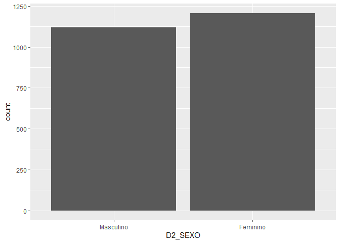
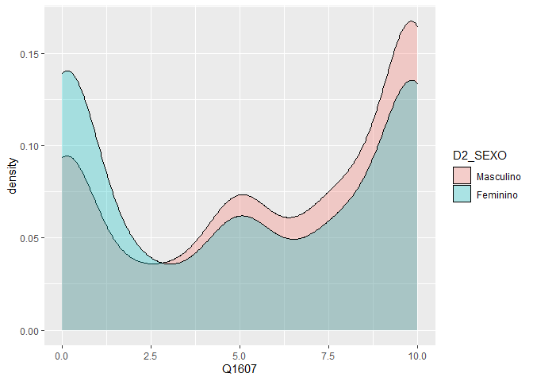
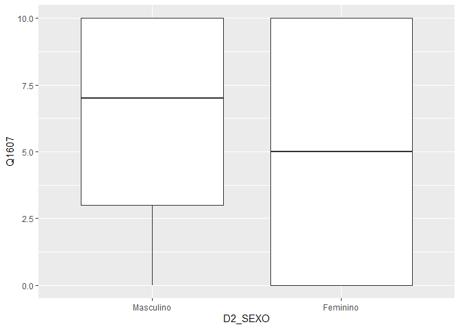
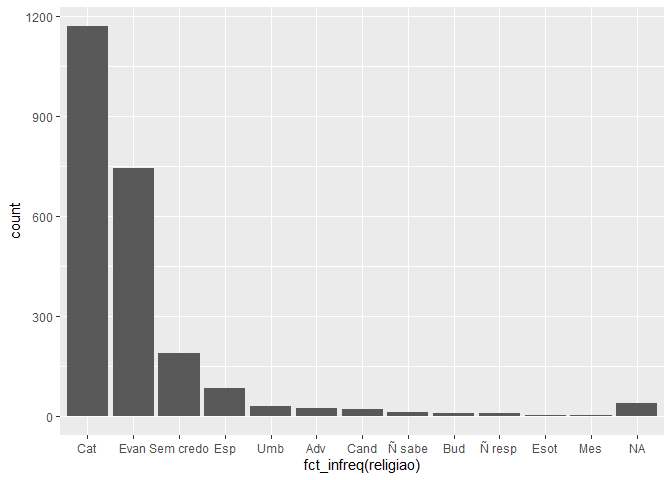
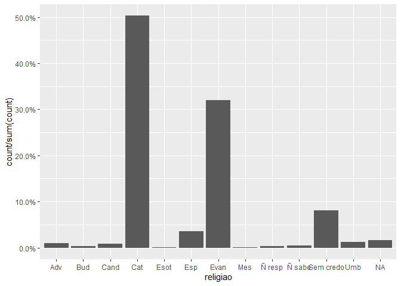
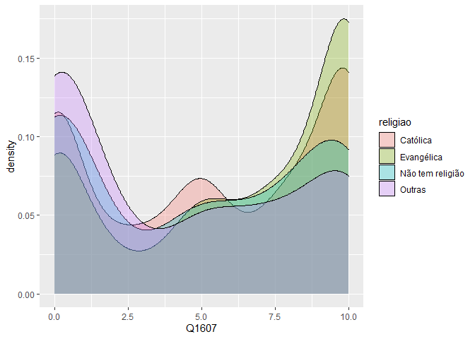
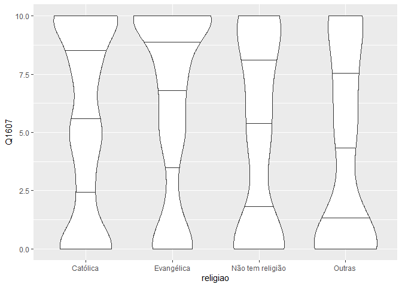

Exercício 8
================
Victor Matheus

### Continuaremos com a utilização dos dados do ESEB2018. Carregue o banco da mesma forma que nos exercicios anteriores

``` r
library(tidyverse)
library(haven)
library(scales)

link <- "https://github.com/MartinsRodrigo/Analise-de-dados/blob/master/04622.sav?raw=true"

banco <- read_spss("04622.sav") 

banco <- banco %>%
  mutate(D2_SEXO = as_factor(D2_SEXO),
         D10 = as_factor(D10)) %>%
  filter(Q1607 < 11)
```

### Começaremos a utilizar no modelo de regressão variáveis qualitativas/categóricas. A primeira delas é sexo (D2\_SEXO). Represente esta variável graficamente.

``` r
ggplot(banco, aes(D2_SEXO)) +
geom_bar()
```

<!-- -->

### Represente graficamente a associação entre sexo e nota atribuida a Bolsonaro (Q1607)

``` r
ggplot(banco, aes(Q1607, fill = D2_SEXO)) +
  geom_density(alpha = 0.3)
```

<!-- -->

``` r
ggplot(banco, aes(D2_SEXO, Q1607)) +
geom_boxplot()
```

<!-- -->

### Teste a associação entre sexo e aprovação de Bolsonaro. Qual é sua conclusão?

RESPOSTA: Observa-se que há associação entre as variáveis: o p-valor deu
bastante significativo e o intervalo de confiança está distante de 0.
Pelos gráficos, nota-se uma maior tendência de apoio à Bolsonaro entre
os homens.A mediana masculina é mais alta, próximo de 7, enquanto a
feminina está em 5. Ambos os gráficos indicam que o apoio à Bolsonaro
entre as mulheres é mais uniformemente distribuido do que entre os
homens, por isso os quartis estariam de tamanho similar no Boxplot, além
da mediana ter se situado exatamente no meio da escala para a categoria
“Feminino”.

``` r
t.test(Q1607 ~ D2_SEXO, data = banco)
```

    ## 
    ##  Welch Two Sample t-test
    ## 
    ## data:  Q1607 by D2_SEXO
    ## t = 5.88, df = 2324, p-value = 4.693e-09
    ## alternative hypothesis: true difference in means is not equal to 0
    ## 95 percent confidence interval:
    ##  0.6392909 1.2790608
    ## sample estimates:
    ## mean in group Masculino  mean in group Feminino 
    ##                6.020536                5.061360

### Faça uma regressão bivariada com estas duas variáveis, verificando em que medida sexo explica a nota atribuida a Bolsonaro. Interprete o resultado da regressão (o \(\beta\), o \(\alpha\), p-valores e medidas de desempenho do modelo)

RESPOSTA: O R rodou a regressão dando os valores a partir da categoria
feminino. O p-valor deu bastante baixo e estatisticamente significante.
O intercepto deu aproximadamente 6 e o coeficiente de inclinação deu
-0.95, indicando uma tendência menor ao apoio à Bolsonaro entre as
mulheres (pouco menos de 1 ponto em comparação com os homens). A partir
da lógica, espera-se que o coeficiente angular para os homens seja +0.95
e que o intercepto seja 5.0693. Ainda que o p-valor tenha sido bastante
significativo, o R-quadrado deu bastante baixo e o erro padrão residual
deu alto, indicando baixo ajuste da amostra ao modelo.

``` r
regressão_sexo_bolsonaro <- lm(Q1607 ~ D2_SEXO, data = banco)
summary(regressão_sexo_bolsonaro)
```

    ## 
    ## Call:
    ## lm(formula = Q1607 ~ D2_SEXO, data = banco)
    ## 
    ## Residuals:
    ##     Min      1Q  Median      3Q     Max 
    ## -6.0205 -4.0614 -0.0205  3.9795  4.9386 
    ## 
    ## Coefficients:
    ##                 Estimate Std. Error t value Pr(>|t|)    
    ## (Intercept)       6.0205     0.1178  51.112  < 2e-16 ***
    ## D2_SEXOFeminino  -0.9592     0.1636  -5.863 5.18e-09 ***
    ## ---
    ## Signif. codes:  0 '***' 0.001 '**' 0.01 '*' 0.05 '.' 0.1 ' ' 1
    ## 
    ## Residual standard error: 3.942 on 2324 degrees of freedom
    ## Multiple R-squared:  0.01458,    Adjusted R-squared:  0.01415 
    ## F-statistic: 34.38 on 1 and 2324 DF,  p-value: 5.178e-09

### Outra variável categórica bastante presente no debate sobre voto na última eleição é religião (D10). Represente esta variável graficamente.

``` r
banco_2 <- banco %>%
  mutate(religiao = case_when(D10 == "Budista" ~ "Bud",
                              D10 == "Candomblé" ~ "Cand",
                              D10 == "Católica" ~ "Cat",
                              D10 == "Espírita kardecista, espiritualista" ~ "Esp",
                              D10 == "Evangélica" ~ "Evan",
                              D10 == "Judaica" ~ "Jud",
                              D10 == "Mórmon, Adventista, Testemunha de Jeová" ~ "Adv",
                              D10 == "Santo Daime, Esotérica" ~ "Esot",
                              D10 == "Seicho-No-Ie, Messiânica, Perfeita Liberdade" ~ "Mes",
                              D10 == "Umbanda" ~ "Umb",
                              D10 == "Outra" ~ "Outra",
                              D10 == "É ateu/agnóstico/Não acredita em Deus" ~ "AA",
                              D10 == "Não sabe (Esp.)" ~ "Ñ sabe",
                              D10 == "Não respondeu (Esp.)" ~ "Ñ resp",
                              D10 == "Não tem religião" ~ "Sem credo"))

ggplot(banco_2, aes(fct_infreq(religiao))) +
  geom_bar()
```

<!-- -->

``` r
ggplot(banco_2, aes(religiao, ..count../sum(..count..) )) +
  geom_bar() +
  scale_y_continuous(labels = percent)
```

<!-- -->

### Crie no banco de dados uma variável de religião modificada chamada `religiao` com as categorias “Evangélica”, “Católica”, “Não tem religião”, e agregue todas as outras na categoria “Outras”.

``` r
Outras <- levels(banco$D10)[-c(3,5,13)]

banco_modificado <- banco %>%
  mutate(religiao = case_when(D10 %in% Outras ~ "Outras",
                              D10 == "Católica" ~ "Católica",
                              D10 == "Evangélica" ~ "Evangélica",
                              D10 == "Não tem religião" ~ "Não tem religião"))


ggplot(banco_modificado, aes(religiao, ..count../sum(..count..) )) +
  geom_bar() +
  scale_y_continuous(labels = percent)
```

<!-- -->

### Represente graficamente a associação entre religiao e nota atribuida a Bolsonaro

``` r
ggplot(banco_modificado, aes(Q1607, fill = religiao)) +
  geom_density(alpha = 0.3)
```

<!-- -->

``` r
ggplot(banco_modificado, aes(religiao, Q1607)) +
geom_boxplot()
```

<!-- -->

``` r
ggplot(banco_modificado, aes(religiao, Q1607)) +
  geom_violin(draw_quantiles = c(0.25, 0.5, 0.75))
```

<!-- -->

### Para fazer o teste estatistico da associação entre as variáveis, não podemos usar o teste-t pois neste caso a variável categórica possui diversos níveis. O adequado é utilizar o teste de ANOVA ou o teste de Kruskal. Abaixo ilustramos como fazer esse teste. O Kruskal-test indica se há diferença entre alguma das categorias da variável e a variável contínua, mas não especifica como as diferentes categorias se diferenciam. Isso pode ser obtido com o teste de Wilcox, que compara os agrupamentos par a par. Como você interpreta esse resultado?

RESPOSTA: O Teste de Kruskal-Wallis deu um p-valor baixo e
estatisticamente significante, indicando que há diferença na forma como
pessoas de diferentes religiões pontuam Bolsonaro. Já o teste de Wilcox
confirma essa tendência, demosntrando que a maioria dos grupos são
estatisticamente diferentes uns dos outros, ainda que a diferença entre
católicos e não religiosos esteja quase no limite da significância
estatítisca. Evangélicos seriam o grupo mais diferenciado de todos,
apresentando grande significância estatística em todas as comparações. A
única comparação não estatisticamente significante foi entre “Não tem
religião” e “Outras”, que apresentou p-valor ao redor de 0,12.

``` r
kruskal.test(Q1607 ~ religiao, data = banco_modificado)
```

    ## 
    ##  Kruskal-Wallis rank sum test
    ## 
    ## data:  Q1607 by religiao
    ## Kruskal-Wallis chi-squared = 61.013, df = 3, p-value = 3.571e-13

``` r
pairwise.wilcox.test(banco$Q1607, banco_modificado$religiao,
                     p.adjust.method = "BH")
```

    ## 
    ##  Pairwise comparisons using Wilcoxon rank sum test with continuity correction 
    ## 
    ## data:  banco$Q1607 and banco_modificado$religiao 
    ## 
    ##                  Católica Evangélica Não tem religião
    ## Evangélica       7.4e-06  -          -               
    ## Não tem religião 0.043    8.3e-06    -               
    ## Outras           1.2e-05  4.4e-11    0.126           
    ## 
    ## P value adjustment method: BH

### Faça uma regressão linear para verificar em que medida religião explica a avaliação de Bolsonaro. Interprete o resultado da regressão (cada um dos \(\beta\)s, o \(\alpha\), p-valores e medidas de desempenho do modelo)

RESPOSTA: A categoria de referência automaticamente escolhida pelo R foi
“Catílica”. Com relação a essa categoria, todas as outras foram
estatisticamente significantes. O intercepto deu 5.44 e os coeficientes
de inclinação variaram. Com relação ao grupo evangélico, a correlação
foi positiva (o que indica que caso o entrevistado seja evangélico,
maior a probabilidade dele ter uma visão favorável de Bolsonaro); ao
passo que a correlação foi negativa com os grupos “Outros” e “Não tem
religião”, indicando a tendência contrária ao que ocorre com
evangélicos. No entanto, ressalta-se que o R-quadrado foi bastante
baixo e que o erro padrão residual foi consideravelmente alto, o que
indica um baixo ajuste da amostra ao modelo.

``` r
regressão_religião_bolsonaro <- lm(Q1607 ~ religiao, data = banco_modificado)
summary(regressão_religião_bolsonaro)
```

    ## 
    ## Call:
    ## lm(formula = Q1607 ~ religiao, data = banco_modificado)
    ## 
    ## Residuals:
    ##    Min     1Q Median     3Q    Max 
    ## -6.259 -4.107  0.559  3.741  5.893 
    ## 
    ## Coefficients:
    ##                          Estimate Std. Error t value Pr(>|t|)    
    ## (Intercept)                5.4410     0.1146  47.470  < 2e-16 ***
    ## religiaoEvangélica         0.8184     0.1838   4.452 8.93e-06 ***
    ## religiaoNão tem religião  -0.6325     0.3081  -2.053   0.0402 *  
    ## religiaoOutras            -1.3339     0.2859  -4.665 3.26e-06 ***
    ## ---
    ## Signif. codes:  0 '***' 0.001 '**' 0.01 '*' 0.05 '.' 0.1 ' ' 1
    ## 
    ## Residual standard error: 3.921 on 2322 degrees of freedom
    ## Multiple R-squared:  0.0261, Adjusted R-squared:  0.02484 
    ## F-statistic: 20.74 on 3 and 2322 DF,  p-value: 2.936e-13

### Faça uma regressao linear avaliando ao mesmo tempo em que medida religiao e sexo explicam a avaliacao de Bolsonaro. Interprete o resultado de cada um dos coeficientes a partir da representação gráfica destes.

RESPOSTA: Os coeficientes mudaram um pouco, mas o padrão geral continuou
o mesmo. O intercepto aumentou para quase 6 em comparação com a
regressão somente com os dados de religião, se aproximando do
intercepto registrado para a regressão somente com a variável “Sexo”. Os
coeficientes de angulação variaram um pouco, sempre na casa dos
centésimos, mas as tendências continuaram (os que tinham correlação
negativa, como mulheres, outra religião ou nenhuma religião continuaram
negativas; e os evangélicos continuaram com a correlação positiva).
Todos os p-valores foram estatisticamente significantes. O gráfico
comprova que há sim significância estatística para todas as variáveis
descritas, uma vez que nenhuma delas atravessa o zero. No entanto, o
erro padrão residual continuou grande e o R-quadrado cresceu pouco, o
que indica o baixo ajuste da amostra ao modelo. Além disso, nota-se um
intervalo de confiança relativamente grande para as variáveis “Não tem
religião” e “Outras religiões”, talvez porque, no caso da primeira
variável, esse seja um grupo bastante diverso mesmo, abrangendo pessoas
de diferentes espectros ideológicos; e no caso da segunda variável,
porque ela agrega diferentes religiões em uma só variável, aumentando as
diferenças dentro da categoria e expandindo o intervalo de confiança.

``` r
library(dotwhisker)

regressão_multivariada_bolsonaro <- lm(Q1607 ~ religiao + D2_SEXO, data = banco_modificado)
summary(regressão_multivariada_bolsonaro)
```

    ## 
    ## Call:
    ## lm(formula = Q1607 ~ religiao + D2_SEXO, data = banco_modificado)
    ## 
    ## Residuals:
    ##     Min      1Q  Median      3Q     Max 
    ## -6.8130 -3.9448  0.1915  3.7365  6.3682 
    ## 
    ## Coefficients:
    ##                          Estimate Std. Error t value Pr(>|t|)    
    ## (Intercept)                5.9493     0.1401  42.477  < 2e-16 ***
    ## religiaoEvangélica         0.8637     0.1825   4.732 2.36e-06 ***
    ## religiaoNão tem religião  -0.6813     0.3057  -2.229   0.0259 *  
    ## religiaoOutras            -1.3130     0.2837  -4.629 3.88e-06 ***
    ## D2_SEXOFeminino           -1.0045     0.1616  -6.215 6.07e-10 ***
    ## ---
    ## Signif. codes:  0 '***' 0.001 '**' 0.01 '*' 0.05 '.' 0.1 ' ' 1
    ## 
    ## Residual standard error: 3.889 on 2321 degrees of freedom
    ## Multiple R-squared:  0.04204,    Adjusted R-squared:  0.04039 
    ## F-statistic: 25.46 on 4 and 2321 DF,  p-value: < 2.2e-16

``` r
dwplot(regressão_multivariada_bolsonaro,
vline = geom_vline(xintercept = 0, colour = "grey60", linetype = 2))
```

<!-- -->
