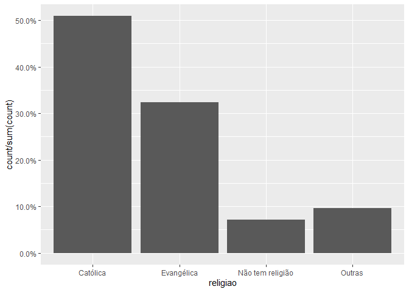

Exercicio 9
================
Victor Matheus

### Continuaremos com a utilização dos dados do ESEB2018. Carregue o banco da mesma forma que nos exercicios anteriores

``` r
library(tidyverse)
library(haven)
library(scales)

link <- "https://github.com/MartinsRodrigo/Analise-de-dados/blob/master/04622.sav?raw=true"

download.file(link, "04622.sav", mode = "wb")

banco <- read_spss("04622.sav") 

banco <- banco %>%
  mutate(D10 = as_factor(D10)) %>%
  filter(Q1607 < 11, 
         Q18 < 11,
         D9 < 9999998,
         Q1501 < 11)
```

### Crie a mesma variável de religião utilizada no exercício anterior

``` r
Outras <- levels(banco$D10)[-c(3,5,13)]

banco <- banco %>%
  mutate(religiao = case_when(D10 %in% Outras ~ "Outras",
                              D10 == "Católica" ~ "Católica",
                              D10 == "Evangélica" ~ "Evangélica",
                              D10 == "Não tem religião" ~ "Não tem religião"))


ggplot(banco, aes(religiao, ..count../sum(..count..) )) +
  geom_bar() +
  scale_y_continuous(labels = percent)
```

<!-- -->

### Faça uma regressão linear avaliando em que medida as variáveis independentes utilizadas nos exercícios 7 e 8, idade(D1A\_ID), educação (D3\_ESCOLA), renda (D9), nota atribuída ao PT (Q1501), auto-atribuição ideológica (Q18), sexo (D2\_SEXO) e religião (variável criada no passo anterior) explicam a avaliação de Bolsonaro (Q1607), mas com uma interação entre as variáveis religião e sexo. Exiba o resultado da regressão e interprete os valores dos coeficientes \(\beta\)s estimados.

RESPOSTA: Dentre as variáveis contínuas, a variável idade teve um beta
estimado em 0.01, o que indica que uma mudança de 1 ano aumenta 0,01 na
avaliação de Bolsonaro. A variável escolaridade teve uma correlação
negativa, indicando que quanto maior for a escolaridade do entrevistado,
menores são as chances dele ter uma visão positiva de Bolsonaro (mais
especificamente, cada avanço na escolaridade decai em média 0.11 a
avaliação de Bolsonaro). A variável renda teve o beta muito pequeno,
devido a grande variação da renda dos entevistados, com correlação
negativa (quanto maior a renda, menor a nota de Bolsonaro). O maior
coeficiente dentre as variáveis contínuas foi o relativo à nota
atribuída ao PT, que teve correlação negativa, indicando que uma
variação postiva de uma unidade na nota atribuída ao PT corresponde em
média a uma variação negativa de 0.39 na nota atribuída a Bolsonaro. Por
fim, a autoavaliação ideológica teve uma correlação positiva de 0.31,
indicando que uma variação de uma unidade na escala ideológica
corresponde a uma variação média de 0.31 na nota de Bolsonaro. Vale
lembrar que todos esses coeficientes são estimados quando as outras
variáveis estão constantes.

Com relação às variáveis categóricas, para a variável sexo, apesar do R
não indicar, muito provavelmente a categoria de referência escolhida foi
“masculino”. Ou seja, a média das notas das mulheres atribuídas a
Bolsonaro é -0.611 menor do que a das notas atribuídas pelos homens. Já
para a variável religião, a categoria de referência foi “Católica”. Os
p-valores mostram que, em comparação com os católicos, os que não tem
religião são o outro grupo mais similar, uma vez que este grupo não teve
relevância estatística. Já o grupo dos evangélicos e das outras religões
apresentaram leve relevância estatística na margem dos 90%, com maior
diferenciação para os evangélicos. Em comparação com os católicos, os
evangélicos tendem a favorecer, em média, 1.18 pontos a Bolsonaro;
enquanto os de outras religiões tendem a desfavorece-lo, em média, 1.58
pontos.

Por fim, com relação à variável com interação, percebe-se que a
interação com religião tendeu a inverter o sentido da correlação: com
relação à religião evangélica, mulheres evangélicas tenderiam em média a
pontuar Bolsonaro em -0.34 do que homens católicos, uma grande diferença
para a variável isolada, que apresentou correlação positiva. O mesmo
pode ser dito para as variáveis “não tem religião” e “outras religiões”,
em que o sentido da correlação mudou, indicando a forte diferença entre
o voto masculino católico e o feminino mesmo entre essas religões.

``` r
options("scipen" = 10)
regressão_multivariada_interação <- lm(Q1607 ~ D1A_ID + D3_ESCOLA + D9 + Q1501 + Q18 + D2_SEXO + religiao + D2_SEXO*religiao, data = banco)
summary(regressão_multivariada_interação)
```

    ## 
    ## Call:
    ## lm(formula = Q1607 ~ D1A_ID + D3_ESCOLA + D9 + Q1501 + Q18 + 
    ##     D2_SEXO + religiao + D2_SEXO * religiao, data = banco)
    ## 
    ## Residuals:
    ##    Min     1Q Median     3Q    Max 
    ## -8.942 -2.561  0.361  2.303  9.052 
    ## 
    ## Coefficients:
    ##                                     Estimate  Std. Error t value Pr(>|t|)    
    ## (Intercept)                       6.11447301  0.59146502  10.338   <2e-16 ***
    ## D1A_ID                            0.01065374  0.00625539   1.703   0.0888 .  
    ## D3_ESCOLA                        -0.11338330  0.04491403  -2.524   0.0117 *  
    ## D9                               -0.00003632  0.00002768  -1.312   0.1897    
    ## Q1501                            -0.39564311  0.02369663 -16.696   <2e-16 ***
    ## Q18                               0.31502274  0.02607173  12.083   <2e-16 ***
    ## D2_SEXO                          -0.61147553  0.24379852  -2.508   0.0122 *  
    ## religiaoEvangélica                1.18072859  0.61461793   1.921   0.0549 .  
    ## religiaoNão tem religião          0.19859068  1.05853540   0.188   0.8512    
    ## religiaoOutras                   -1.58309059  0.95031319  -1.666   0.0960 .  
    ## D2_SEXO:religiaoEvangélica       -0.34121012  0.38950878  -0.876   0.3812    
    ## D2_SEXO:religiaoNão tem religião -0.18889941  0.69787901  -0.271   0.7867    
    ## D2_SEXO:religiaoOutras            0.50409816  0.60674166   0.831   0.4062    
    ## ---
    ## Signif. codes:  0 '***' 0.001 '**' 0.01 '*' 0.05 '.' 0.1 ' ' 1
    ## 
    ## Residual standard error: 3.297 on 1449 degrees of freedom
    ## Multiple R-squared:  0.3028, Adjusted R-squared:  0.297 
    ## F-statistic: 52.44 on 12 and 1449 DF,  p-value: < 2.2e-16

### Interprete a significancia estatística dos coeficientes estimados

RESPOSTA: A significância estatística alterou bastante entre as
variáveis. Apenas as variáveis nota atribuída ao PT e autoavaliação
ideológica tiveram um p-valor bastante baixo. A variável escolaridade
apresentou significânica estatística no limiar de 95% e a variável idade
no limiar de 90%. A variável renda não foi estatisticamente
significante. Com relação as variáveis categóricas, sexo deu relevância
estatísitca no limiar de 95%, e as categorias evagélica e outras
religiões deram significância estatística na margem dos 90%, ao passo
que a categoria sem religião não deu significância estatísitca,
indicando a semelhança entre esta categoria e os católicos, que foi
escolhida como categoria de referência. Já as variáveis da interação não
deram significiância estatística, o que pode indicar um certo grau de
semelhança entre elas e os homens católicos.

### Faça um gráfico que mostre a interação entre as duas variáveis. Interprete o resultado apresentado

RESPOSTA: O gráfico mostra que os intervalos de confiança para os
valores masculinos e femininos são distantes nas categorias católica e
evangélica, ao passo que nas categorias outras e não tem religião eles
se sobrepõem, principalmente na categoria outras. Isso indica que a
opinião entre homens e mulheres com relação a Bolsonaro difere nas
categorias católico e evangélico, é praticamente similar na categoria
outras religiões, e é parcialmente similar em “não tem religião”. Em
outras palavras, o sexo tem influência na avaliação de Bolsonaro em
certas categorias religiosas (as duas cristãs) mas seus efeitos nas
categorias “sem religião” e “outras” seriam mais fracos, sobretudo nesta
última. Percebe-se que, em média, os homens tendem a ter uma visão mais
positiva de Bolsonaro do que as mulheres, com exceção da categoria
“outras religiões”, em que os intervalos são praticamente iguais; o
que reforça o coeficiente negativo quando a variável “sexo” é
considerada sem interação. Ademais, nota-se que o grupo mais favorável a
Bolsonaro no geral é o evangélico, com destaque para os homens
evangélicos (mas mesmo entre as mulheres, o grupo evangélico também é o
com a pontuação mais alta), o que conjuntamente reforça o o alto
coeficiente positivo quando a categoria “evangélico” é considerada sem
interação.

``` r
library(sjPlot)

plot_model(regressão_multivariada_interação, type = "pred",
           terms = c("religiao", "D2_SEXO"),
           ci.lvl = 0.9)
```

<!-- -->
